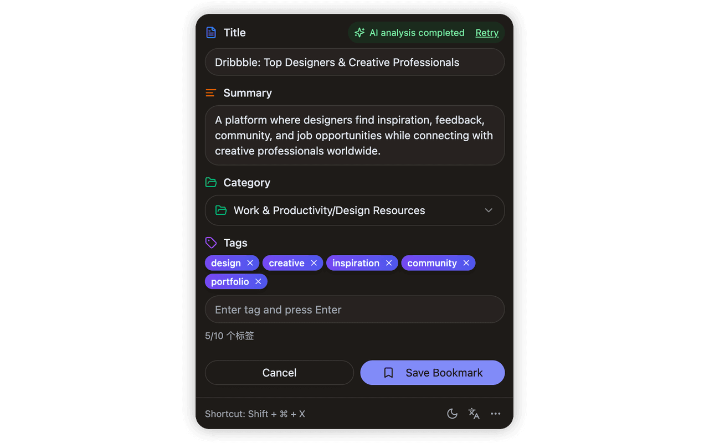
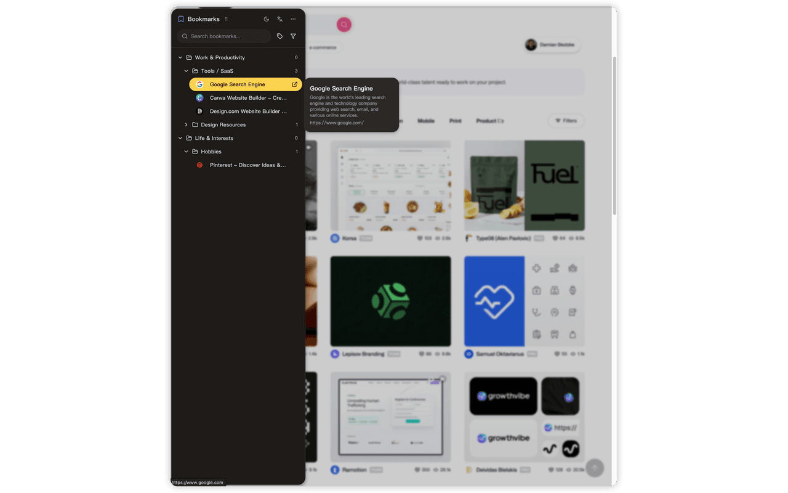
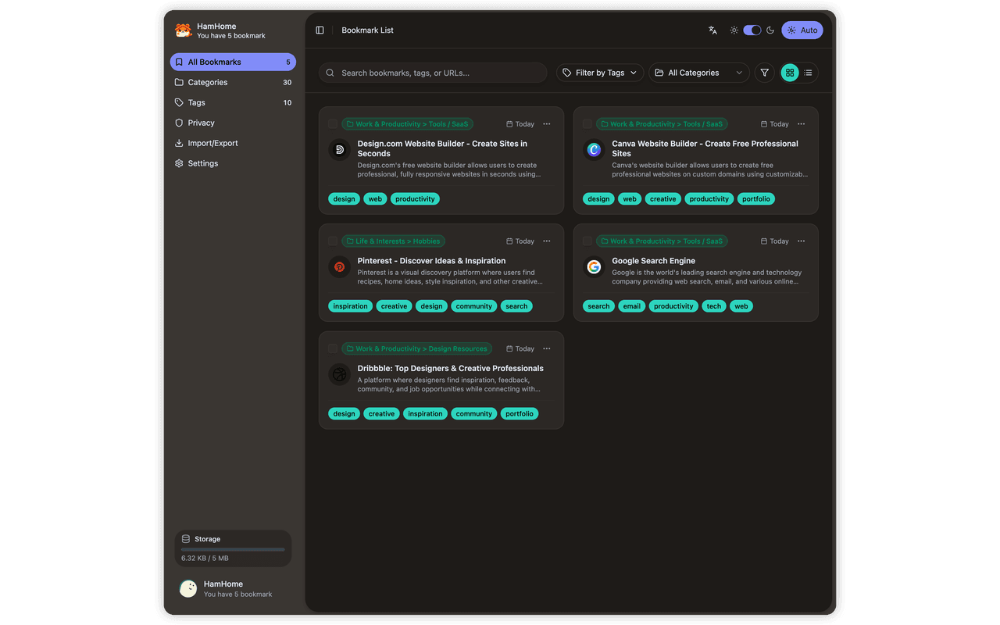
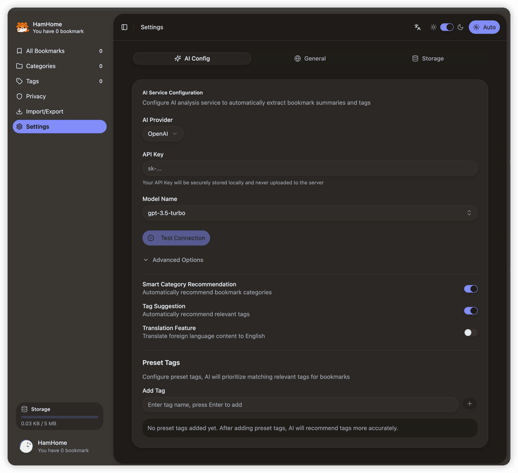

<p>
  
</p>

# HamHome

**AI-Powered Bookmark Manager for Modern Browsers**

<p>
  
  
  
  
  
</p>

<p>
  <a href="https://bingoyb.github.io/ham_home/">Product Introduction</a> •
  <a href="./docs/README_zh.md">中文文档</a> •
  <a href="#features">Features</a> •
  <a href="#development">Development</a> •
  <a href="#contributing">Contributing</a>
</p>

## What is HamHome?

HamHome is a browser extension that helps you collect, organize, and retrieve web content intelligently. It uses AI to automatically categorize pages, generate summaries, and suggest tags—while keeping your data local and private.

👉 **[View Product Introduction](https://bingoyb.github.io/ham_home/)** - Learn more about features and capabilities

## Screenshots

| |
|:---:|
| **Save Panel** |
|  |
| **Side Panel** |
|  |
| **Management Page** |
|  |
| **Settings Page** |
|  |

## Features

### 🤖 AI-Assisted Organization

- Auto-categorization based on page content
- Smart tag suggestions with configurable presets
- AI-generated summaries for quick reference
- BYOK (Bring Your Own Key) support for OpenAI, Anthropic, Ollama, and custom endpoints

### 🗂️ Category Management

- **Preset Schemes**: Two built-in category templates—"General" and "Professional Creator"—with one-click import
- **AI-Generated Categories**: Describe your use case and let AI create a tailored category structure
- Unlimited hierarchical category tree

### 📸 Page Snapshots

- Save complete HTML snapshots locally
- Access content even when the original page goes offline
- Powered by [Mozilla Readability](https://github.com/mozilla/readability) for clean extraction

### 🔍 Powerful Search & Filtering

- Full-text search across titles, descriptions, and content
- Filter by category, tags, and time range
- Create custom filter presets for complex queries

### 🎯 Privacy-First Design

- All data stored locally in Chrome Storage + IndexedDB
- Configure privacy domains to exclude sensitive sites from AI analysis
- Export/import your data anytime (JSON format)

### 🖥️ Modern UI

- Grid (masonry) and list view modes
- Light/dark theme with system preference detection
- Full i18n support (English & Chinese)
- Keyboard shortcuts and edge-trigger panel

## Browser Support

| Browser           | Status            |
| ----------------- | ----------------- |
| Chrome / Chromium | ✅ Manifest V3    |
| Microsoft Edge    | ✅ Manifest V3    |
| Firefox           | ✅ Manifest V2/V3 |

## Downloads

- [**Chrome Web Store**](): Pending upload
- [**Firefox Add-ons**](): Pending upload
- [**Microsoft Edge Addons**](https://microsoftedge.microsoft.com/addons/detail/hamhome-smart-bookmark-/nmbdgbicgagmokdmohgngcbhkaicfnpi)
- See [releases](https://github.com/bingoYB/ham_home/releases) to download and install manually.

## Installation

### From Source

```bash
# Clone the repository
git clone https://github.com/bingoYB/ham_home.git
cd ham_home

# Install dependencies (requires pnpm)
pnpm install

# Build for Chrome/Edge
pnpm --filter extension build

# Build for Firefox
pnpm --filter extension build:firefox
```

### Load the Extension

- **Chrome/Edge**: Navigate to `chrome://extensions/`, enable "Developer mode", click "Load unpacked", and select `apps/extension/.output/chrome-mv3`
- **Firefox**: Go to `about:debugging`, click "This Firefox", click "Load Temporary Add-on", and select `apps/extension/.output/firefox-mv2/manifest.json`

## Development

```bash
# Start dev server (Chrome)
pnpm --filter extension dev

# Start dev server (Firefox)
pnpm --filter extension dev:firefox

# Build all browser variants
pnpm --filter extension build:all
```

## Tech Stack

<p>
  
  
  
  
</p>

- **Framework**: [WXT](https://wxt.dev/) (Vite-based extension framework)
- **UI**: React 19 + TypeScript + Tailwind CSS
- **Components**: [shadcn/ui](https://ui.shadcn.com/)
- **Content Extraction**: Mozilla Readability + Turndown
- **i18n**: i18next + react-i18next
- **Storage**: Chrome Storage API + IndexedDB

## Project Structure

```
ham_home/
├── apps/
│   └── extension/          # Browser extension
│       ├── components/     # React components
│       ├── hooks/          # Custom hooks
│       ├── lib/            # Core libraries (AI, storage, i18n)
│       ├── entrypoints/    # Extension entry points
│       └── locales/        # i18n resources
├── packages/
│   ├── ui/                 # Shared UI components
│   ├── types/              # Shared TypeScript types
│   └── ...                 # Other shared packages
└── docs/                   # Documentation
```

## Contributing

Contributions are welcome! Please:

1. Fork this repository
2. Create a feature branch (`git checkout -b feature/your-feature`)
3. Commit your changes (`git commit -m 'Add your feature'`)
4. Push to the branch (`git push origin feature/your-feature`)
5. Open a Pull Request

## License

[MIT](./LICENSE)

---

<p align="center">
  If you find HamHome useful, consider giving it a ⭐
</p>
