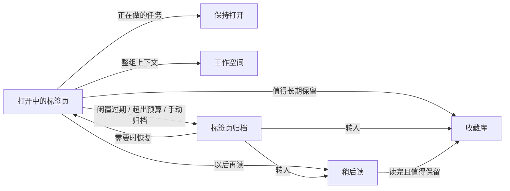
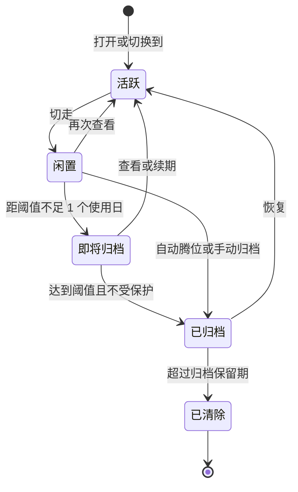
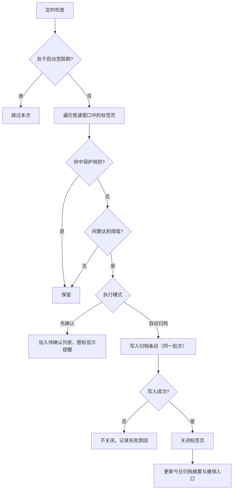
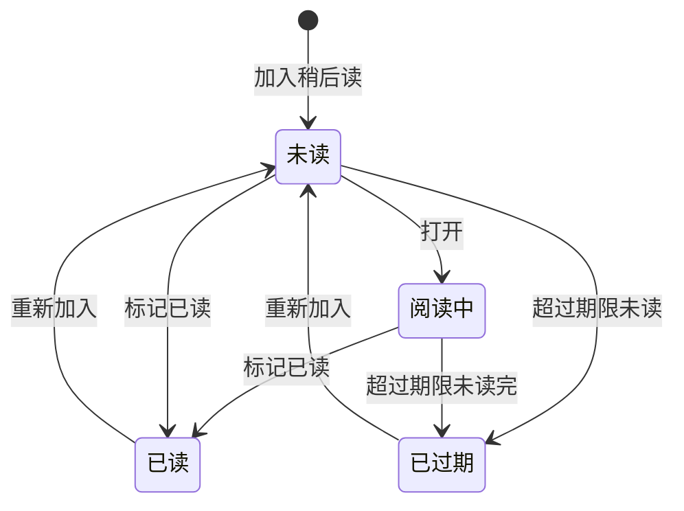
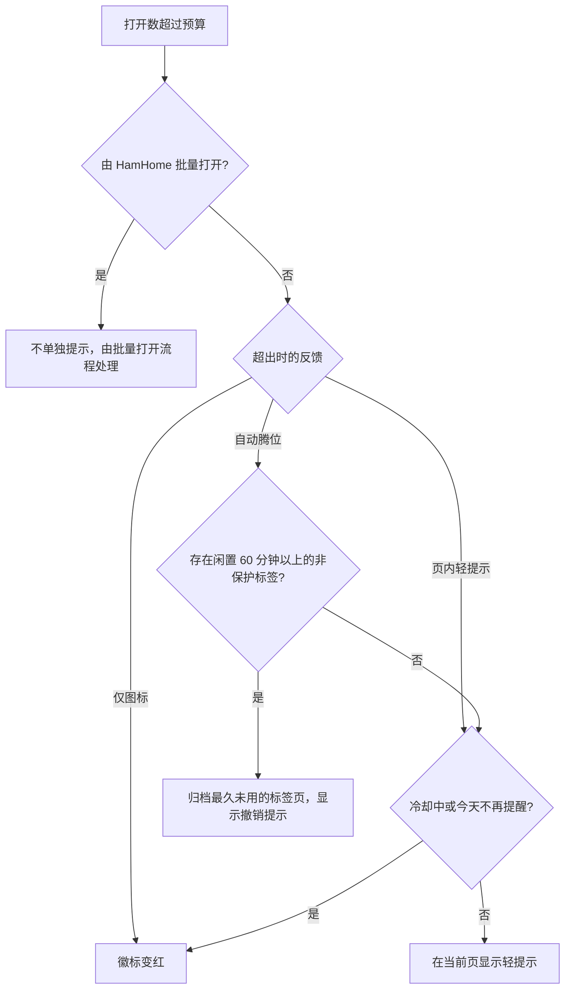

# HamHome 标签页减负 PRD：自动归档、稍后读与标签预算

## 0. 文档信息

| 字段 | 内容 |
| --- | --- |
| 文档状态 | Draft / 待评审 |
| 版本 | v0.1 |
| 日期 | 2026-09-28 |
| 产品范围 | HamHome 浏览器扩展 |
| 目标版本 | 待排期（建议 Phase 1 随 v1.5.0 发布） |
| 涉及能力 | 标签页活动记录、自动归档与标签页归档、稍后读、标签预算、标签页中心 |
| 主要平台 | Chrome / Edge（MV3）、Firefox（MV2） |
| 关联文档 | `prd-rich-clipping-screenshot-health-center.md`、`browser-compatibility.md` |

## 1. 执行摘要

HamHome 的承诺是“找到你保存过的，接着做你没做完的”。目前它已经管好了用户**主动保存**的内容：书签、剪藏、快照、截图和工作空间。但用户每天最大的一块未整理资产并不在收藏库里，而是**一直开着、舍不得关的标签页**。

标签页无限增长的根源是一个不对称：关掉一个标签页的代价是具体的（可能再也找不到），留着它的代价是分散的（内存、注意力、焦虑）。所以本需求的目标不是“帮用户关标签页”，而是**让关闭变得零风险，让每个标签页都有更合适的去处**：

1. **自动归档**：闲置超过 7 天（按使用日计算）的标签页自动关闭，关闭前写入“标签页归档”，可搜索、可一键恢复；固定标签页永远不处理。
2. **稍后读**：把“以后再看”从标签栏移到一个有状态、会过期的阅读队列，一次操作完成“加入稍后读并关闭标签页”。
3. **标签预算**：给打开的标签页设一个上限（默认 15），通过图标数字、轻提示和整理面板让数量可见、可控；自动腾位需用户显式开启。
4. **标签页中心**：统一的整理界面，查看所有打开的标签页的闲置时长、重复和保护状态，批量送往稍后读、收藏库、工作空间或归档。



### 1.1 核心产品决策

- **关闭不等于丢失**：HamHome 关闭的每个标签页都必须先写入归档，再执行关闭；归档写入失败时不关闭。
- 三项能力**默认关闭**，首次进入标签页中心时通过引导开启，并展示对当前标签页的影响预览。
- **固定标签页永不自动关闭、永不计入预算**；各窗口当前显示的标签页、用户锁定的标签页、正在播放声音的标签页同样不会被自动关闭。
- 闲置时长默认按**使用日**计算（只统计用户实际使用浏览器的日子），出差、休假回来不会被批量清理。
- 首次开启自动归档**不追溯**：默认从开启时刻开始计时，已有的陈年标签页交给用户在整理面板中主动处理。
- 活动时间由 HamHome **自建本地记录**，不把 `tab.lastAccessed` 作为关闭依据（该字段 Chrome 121 才提供，且在标签休眠、移动后有问题报告）。
- **稍后读是书签的一种状态，不是新的数据孤岛**：复用保存管线、搜索、回收站与同步；但仅加入稍后读的条目默认不进入收藏库视图、书签体检和 AI 分类。
- **稍后读自身也会过期**：未读 30 天转入“已过期”，防止稍后读变成新的标签页坟场。
- 标签预算默认**只提示、不强制**，永不拦截新标签页；自动腾位只处理闲置 ≥ 60 分钟的非保护标签页，且需用户显式开启。
- 活动记录与归档**只保存在本地设备**，不进入 WebDAV；稍后读状态与生命周期设置可同步，但使用独立同步文件，避免旧版本客户端覆盖新字段。
- 不接管新标签页、不做内存休眠、不记录用户手动关闭的标签页（浏览器历史与“最近关闭”已覆盖）。

## 2. 背景与问题

### 2.1 标签页为什么会无限增长

标签页同时承担着多种角色，而浏览器只提供了一种容器。每一种“留着不关”的理由，都应该有一个比标签栏更合适的去处：

| 留着不关的理由 | 用户心声 | 真实需求 | HamHome 去处 |
| --- | --- | --- | --- |
| 正在进行的任务 | “这个还没做完” | 工作集 | 保持打开；切换任务时收起为工作空间 |
| 想以后读 | “这篇回头看” | 阅读队列 | 稍后读 |
| 以后可能用到 | “万一还要找” | 长期参考 | 收藏库（书签） |
| 一组调研资料 | “这些要一起看” | 可恢复的上下文 | 工作空间 |
| 提醒自己 | “明天要处理” | 待办提醒 | 稍后读的延后提醒（P2） |
| 忘了关、舍不得关 | 无意识堆积、害怕丢失 | 安全网 | 自动归档 + 可搜索、可恢复 |

### 2.2 当前能力基础

HamHome 已具备可以直接复用的基础：

- **权限**：已声明 `tabs`、`tabGroups`（仅 Chromium）、`alarms`、`scripting`、`contextMenus`、`storage`、`unlimitedStorage` 和 `<all_urls>`，Phase 1 不需要新增必需权限。
- **后台任务**：`browser.alarms` 已用于书签体检（每周/每月）、回收站保留期清理（每日）和 WebDAV 同步（30 分钟周期 + 本地变更 5 分钟防抖）。
- **标签页事件**：后台已监听 `tabs.onCreated`、`tabs.onUpdated`、`tabs.onRemoved`，用于 Tab Group 自动分组。
- **工作空间**：保存/恢复窗口（含固定状态、Tab Group 标题与颜色）、恢复时跳过重复 URL、恢复后短暂抑制自动分组、保存后关闭已保存标签（`closeSavedPageTabs`）；页面分析已有重复识别、用途分类（含“待阅读”规则）和转书签候选（排除搜索页与登录页）。
- **书签管线**：页面元数据与正文提取、AI 摘要/分类/标签、快照与截图、关键词与语义搜索、回收站 30 天保留、按 URL 对齐的同步与删除墓碑。
- **URL 规范化与隐私检测**：`normalizeBookmarkUrl` 与追踪参数清理可直接用于重复标签检测；`privacy-detector` 已能识别登录、邮箱、支付、敏感查询参数与常见 Web 应用域名。
- **界面**：Popup 快捷面板（快捷操作、最近保存、快速设置）；页内 Shadow DOM UI（边缘面板与保存浮层，内容脚本匹配 `<all_urls>`）；主应用侧栏支持计数徽标。

尚不具备的能力：

- 没有标签页使用时间记录：未监听 `tabs.onActivated`、`windows.onFocusChanged`、`tabs.onReplaced`、`runtime.onStartup`，也未使用 `tab.lastAccessed`。
- 没有归档、稍后读、预算概念，也未使用 `sessions`、`tabs.discard` 和工具栏徽标。
- `commands` 已占用 3 个建议快捷键（保存书签、保存工作空间、切换面板）；Chrome 每个扩展最多预设 4 个，只剩 1 个槽位。
- 同步 schema 使用 zod 解析，未知字段会被剥离；设置按整份文档以 `updatedAt` 合并。直接在书签元数据或 `LocalSettings` 上加字段，会被旧版本客户端在回写时抹掉。

### 2.3 市场参照

| 产品 | 做法 | 对 HamHome 的启示 |
| --- | --- | --- |
| Arc | 未固定标签页默认闲置 12 小时自动归档，可选 24 小时 / 7 天 / 30 天，查看即重置计时 | “自动归档”可以成为默认心智，前提是归档可找回 |
| Chrome Tab Declutter | 7 天未使用视为不活跃，在标签搜索中建议关闭，并识别重复标签页 | 浏览器原生正在覆盖“建议关闭”，HamHome 要在“关闭后去哪”上做出差异 |
| Safari（iOS） | 可设置一天 / 一周 / 一个月后自动关闭标签页 | 同上 |
| Tab Wrangler | 自动关闭闲置标签到可搜索的 Tab Corral；支持锁定、排除域名、最少保留数、保留播放音频和分组内的标签 | 保护规则清单是用户信任的基础 |
| Auto Tab Discard、浏览器 Memory Saver / 睡眠标签页 | 休眠释放内存，标签仍留在标签栏 | 解决的是内存而非注意力，HamHome 不重复建设 |
| Pocket（2025 年 7 月关停）、Instapaper、Readwise Reader、Raindrop | 独立的稍后读服务 | 稍后读存在迁移需求；本地优先、AI 摘要、离线快照和收藏库一体化是差异点 |

**差异化一句话**：浏览器负责把标签页关掉，HamHome 负责让关掉的标签页**找得回、看得懂、去得对**——可搜索，有摘要，并能一键转为稍后读、书签或工作空间。

## 3. 灵感评估：从三条规则到一个闭环

| 原始灵感 | 保留 | 需要修正的风险 | 本 PRD 的处理 |
| --- | --- | --- | --- |
| 7 天没打开自动关闭；关闭前保存到历史；固定标签页永不动 | 7 天默认阈值、先存后关、固定页豁免 | 按自然日计时，休假回来被批量清理；首次开启一次性关掉上百个标签；浏览器重启后标签 ID 变化导致计时丢失 | 使用日计时；首次不追溯；启动宽限期；自建活动记录并在重启后对齐；整批撤销 |
| 把“想以后看”移出标签栏，放到稍后读 | 在产生“以后看”意图的瞬间一键移出 | 只是把堆积从标签栏搬到稍后读；与收藏库混在一起；批量加入带来 AI 费用 | 稍后读自身会过期；“已读”闭环；默认不进收藏库；TL;DR 辅助分拣；右键链接直接稍后读，从源头少开标签 |
| 标签预算：最多 15 个 | 明确上限、可见反馈 | 一刀切的 15 对重度用户过低，持续打扰会让功能被关闭；强制拦截破坏体验；恢复工作空间时瞬间超额 | 默认只提示；自动腾位显式开启；固定页不计入；渐进预算；工作空间“上下文切换” |

三条规则组合后形成一个闭环：**预算让数量可见 → 去处让关闭有意义 → 自动归档兜底遗忘 → 归档消除“丢失”的焦虑**。

## 4. 产品目标与非目标

### 4.1 产品目标

| ID | 目标 |
| --- | --- |
| G-01 | 用户可以在不担心丢失的前提下，让闲置标签页自动离开标签栏 |
| G-02 | HamHome 关闭的每一个标签页都可以在保留期内被搜索和恢复 |
| G-03 | 用户可以用一次操作把“以后再看”的页面移入稍后读并关闭标签页 |
| G-04 | 稍后读队列保持可消化：有已读闭环、有过期机制、有分拣辅助 |
| G-05 | 用户可以设定并看见标签预算，超出时得到低打扰的整理引导 |
| G-06 | 新能力与收藏库、工作空间、Tab Group、AI、同步打通，不形成新的数据孤岛 |
| G-07 | 继续遵守本地优先与隐私可控：活动记录和归档不离开设备，AI 只在用户启用时接收最少信息 |
| G-08 | 后台追踪足够轻量，500 个标签页下不影响浏览器与扩展性能 |

### 4.2 本期非目标

- 不做内存优化型休眠（`tabs.discard`），依赖浏览器原生的 Memory Saver / 睡眠标签页。
- 不接管新标签页（`chrome_url_overrides` 无法按需开启，且对用户侵入性强）。
- 不阻止用户打开新标签页，不提供“硬上限”。
- 不记录用户手动关闭的标签页。
- 不把“打开中的标签页”同步到其他设备，不同步归档。
- 不默认抓取被归档页面的正文，不把归档内容发送给 AI。
- 不处理隐身窗口、App 窗口和 Popup 窗口。
- Phase 1 不提供阅读模式、延后提醒和第三方稍后读导入。

## 5. 目标用户与核心场景

### 5.1 标签页囤积者

长期保持 50–300 个标签页，靠标签栏“记事”。希望自动清理但别弄丢，最关心保护规则和恢复能力。

### 5.2 阅读与研究用户

每天遇到大量“回头看”的文章、文档和视频。希望一键移出标签栏，之后能快速判断哪些值得读，读完后把好内容沉淀到收藏库。

### 5.3 多任务切换者

开发者、产品经理、学生同时推进多个项目，标签页混在一起。希望控制同时打开的数量，切换任务时把一整组标签页收起，之后原样恢复。

### 5.4 端到端体验示例

> 周一早上，浏览器图标显示红色的 **18**。打开快捷面板：“标签页 18/15 · 4 个超过 7 天未打开 · 2 组重复”。点击“整理一下”，关掉 2 个重复页，把 3 篇长文送进稍后读，剩下的交给自动归档。
>
> 周三，想找上周看过的一篇定价策略文章。它已被自动归档，在标签页中心的“归档”里搜索 “pricing” 就能找到，点击“恢复”。
>
> 周五，稍后读顶部提示“3 篇将在 3 天内过期”。在分拣模式里逐条看 TL;DR：读 1 篇，收藏 1 篇，删除 1 篇。

## 6. 核心概念与信息架构

### 6.1 标签页生命周期



“受保护”是与生命周期正交的属性：受保护的标签页可以处于任何阶段，但永远不会被自动转入“已归档”。

### 6.2 六个去处

| 去处 | 定义 | 由谁放入 | 生命周期 | 是否同步 |
| --- | --- | --- | --- | --- |
| 标签页 | 正在使用的工作集 | 用户 | 用户关闭或被归档 | 否 |
| 稍后读 | 打算近期消费的阅读队列 | 用户（可由整理建议发起） | 未读 30 天后过期，不自动删除 | 是 |
| 收藏库 | 值得长期保留的书签与剪藏 | 用户 | 长期 | 是 |
| 工作空间 | 可整组恢复的浏览上下文 | 用户 | 长期 | 是 |
| 标签页归档 | HamHome 关闭标签页时的安全网 | HamHome | 默认保留 90 天 | 否 |
| 回收站 | 被删除的收藏库与稍后读条目 | 用户 | 30 天后彻底删除 | 以墓碑同步 |

命名约束：“归档”只指标签页归档，不用于书签；书签删除进入“回收站”，两者的文案和图标必须区分。

### 6.3 导航与入口

**主应用侧栏**

- 新增“稍后读”，位于“所有书签”之后，徽标显示未读数。
- 新增“标签页”（标签页中心），位于“工作空间”之前，徽标显示当前打开数；内含“打开中 / 归档 / 规则”三个视图。
- “所有书签”计数不再包含仅在稍后读中的条目。
- 本期不调整“Tab 分组”页面；后续可评估把侧栏分为“内容 / 标签页与会话 / 管理”三组，或将“Tab 分组”并入标签页中心。

**Popup 快捷面板**

- 快捷操作调整为：保存当前页、稍后读并关闭、保存窗口为工作空间、打开 HamHome；“设置”移至面板顶部图标。
- 新增“标签页”卡片：预算进度、待整理数量和“整理一下”入口。
- “最近保存”增加“稍后读”页签。

**其他入口**

- 右键菜单：页面“稍后读”；链接“稍后读此链接”（不打开链接）。Firefox 额外支持标签页右键菜单。
- 快捷键：新增“稍后读并关闭当前标签页”，占用最后一个建议快捷键槽位。
- 页内 UI：超出预算轻提示、撤销提示、“读完了吗”阅读条（P1）；边缘面板增加稍后读列表（P1）。
- 地址栏 `ham` 搜索：结果包含稍后读，并可选包含归档（P1）。
- AI Agent：新增标签页与稍后读工具（P1）。

整理操作优先在 Popup 与页内 UI 中完成，避免“为了整理标签页再打开一个标签页”；标签页中心用于批量和深度整理。

## 7. 功能一：标签页活动记录（基础能力）

自动归档、预算腾位、闲置显示和整理建议都依赖可靠的“最后使用时间”，这是本需求的第一块基石。

### 7.1 功能范围

| ID | 需求 | 优先级 |
| --- | --- | --- |
| TRK-001 | 记录普通窗口中每个标签页的 `firstSeenAt` 与 `lastActiveAt` | P0 |
| TRK-002 | 标签被激活、所在窗口获得焦点、从当前标签切走时更新使用时间 | P0 |
| TRK-003 | 活动标签页在前台导航视为使用；后台标签页自动刷新或跳转不视为使用 | P0 |
| TRK-004 | 记录“使用日”：当天存在标签激活、窗口聚焦或前台导航等用户交互即计为 1 个使用日，保留最近 120 天 | P0 |
| TRK-005 | 浏览器重启或扩展更新后，按规范化 URL 与窗口位置对齐历史记录；无法对齐时以当前时间为准 | P0 |
| TRK-006 | 正确处理 `onReplaced`、`onAttached`、`onDetached`、`onRemoved`，避免记录错配或残留 | P0 |
| TRK-007 | 在事件处理内完成持久化，不依赖 Service Worker 内存状态；按单条记录写入 | P0 |
| TRK-008 | 忽略隐身窗口、App 窗口和 Popup 窗口 | P0 |
| TRK-009 | 活动记录在新版本安装后即在本地开始，用于显示闲置时长和首次开启时的现状预览；可在规则中关闭并清空 | P0 |
| TRK-010 | HamHome 自身记录不足时，才使用 `tab.lastAccessed` 作为首次开启的参考预览，且不作为自动关闭依据 | P0 |
| TRK-011 | 活动记录只保存在本地，不同步、不导出、不发送给 AI | P0 |

活动记录不依赖任何功能开关即开始，是为了让用户第一次打开标签页中心时就能看到有意义的闲置时长。它与浏览器自身保存的访问时间性质相同，只在本地使用，并在隐私说明中明确披露。

### 7.2 计时规则

- **天级阈值**：同时满足两个条件才算过期：距 `lastActiveAt` 的自然时长 ≥ 阈值，且 `lastActiveAt` 所在日期之后的使用日数量 ≥ 阈值。UI 文案：“7 天未打开（只计算你使用浏览器的日子）”。
- **自然日模式**：用户可切换为只看自然时长。
- **小时级阈值**（如 12 小时）：只按自然时长计算，但仍受启动宽限期约束。
- **保守原则**：任何不确定——记录缺失、重启后无法对齐、系统时间回拨（当前时间早于记录时间）——都按“刚刚使用过”处理。宁可晚关，不可早关。
- **后台打开从未查看的标签页**（如中键打开）从打开时刻开始计时，到期同样归档。这是符合预期的：它们正是“以后再看”的堆积来源。

### 7.3 重启对齐

标签页 ID 在浏览器重启后会变化。启动时：

1. 读取上一次会话留下的记录，按规范化 URL 建立候选列表；
2. 按窗口与位置顺序遍历当前标签页，优先匹配同 URL、同位置的旧记录，继承 `firstSeenAt` 与 `lastActiveAt`；
3. 未匹配的标签页以当前时间作为 `lastActiveAt`；
4. 未被认领的旧记录直接丢弃；
5. 锁定状态额外按 URL 保存，确保重启后锁定依然有效。

## 8. 功能二：自动归档与标签页归档

### 8.1 用户故事

- 作为标签页囤积者，我希望很久没看的标签页自动离开标签栏，而我不必逐个决定。
- 作为谨慎用户，我希望固定页、正在播放的音乐和我锁定的页面永远不被关闭。
- 作为经常出差的用户，我希望休假回来不会发现标签页被清空。
- 作为回找用户，我希望在一个地方搜索和恢复 HamHome 关掉的标签页。
- 作为第一次开启的用户，我希望先看到会发生什么，而不是一下子被关掉 100 个标签页。

### 8.2 功能范围

| ID | 需求 | 优先级 |
| --- | --- | --- |
| ARC-001 | 自动归档总开关，默认关闭 | P0 |
| ARC-002 | 闲置阈值可选 12 小时、1 / 3 / 7 / 14 / 30 天，默认 7 天 | P0 |
| ARC-003 | 天级阈值默认按使用日计算，可切换为自然日 | P0 |
| ARC-004 | 内置保护规则（见 8.4），固定标签页保护不可关闭 | P0 |
| ARC-005 | 用户可锁定单个标签页，并维护保护域名列表 | P0 |
| ARC-006 | 执行模式：自动归档（默认）/ 先确认 | P0 |
| ARC-007 | 执行模式：仅标记（只在界面显示“已过期”，不关闭） | P1 |
| ARC-008 | 先存后关：归档写入成功后才关闭标签页 | P0 |
| ARC-009 | 首次开启不追溯，提供现状预览与“现在整理一下”入口 | P0 |
| ARC-010 | 浏览器启动后 15 分钟内不执行自动归档 | P0 |
| ARC-011 | 单次最多归档 30 个标签页，超出部分顺延到下次执行 | P0 |
| ARC-012 | 每次执行生成批次；Popup 显示“今天自动归档了 N 个”，支持整批撤销 | P0 |
| ARC-013 | 标签页中心标记“即将归档”，支持续期（重置计时）与锁定 | P1 |
| ARC-014 | 可选保护：Tab Group 内的标签页（全局开关，以及 Tab 分组规则级开关） | P1 |
| ARC-015 | 可选保护：页面存在未提交的输入内容 | P1 |
| ARC-016 | 可选保护：打开的标签页少于 N 个时不归档 | P1 |
| ARC-017 | 归档库：按日期和批次分组，按原因、域名筛选，按标题与 URL 搜索 | P0 |
| ARC-018 | 归档条目支持恢复、加入稍后读、收藏、加入工作空间、删除，以及批量操作 | P0 |
| ARC-019 | 归档保留期 30 / 90 / 180 天或永久，默认 90 天；上限 10,000 条 | P0 |
| ARC-020 | 同一 URL 再次归档时合并为一条并累计次数 | P1 |
| ARC-021 | 自动归档后 24 小时内被恢复的比例偏高时，建议用户提高阈值 | P2 |
| ARC-022 | 可选在归档时提取正文摘要用于搜索（默认关闭，隐私页面永不提取） | P2 |
| ARC-023 | 归档语义搜索 | P2 |

### 8.3 归档判定流程

由 `tab-lifecycle-sweep` 定时任务每 30 分钟执行一次。



### 8.4 保护规则

| 规则 | 默认 | 可否关闭 | 说明 |
| --- | --- | --- | --- |
| 固定标签页 | 保护 | 不可关闭 | 即“固定标签页永不动” |
| 各窗口当前显示的标签页 | 保护 | 不可关闭 | 包括非焦点窗口中的当前标签 |
| 用户锁定的标签页 | 保护 | 不可关闭 | 在标签页中心或 Popup 中锁定，重启后保留 |
| HamHome 保存流程进行中 | 保护 | 不可关闭 | 页内保存浮层打开，或快照、截图处理中 |
| 正在播放声音或 10 分钟内播放过 | 保护 | 可关闭 | 避免关掉后台音乐与会议 |
| 保护域名 | 空列表 | 可编辑 | 首次引导时根据已固定页面和检测到的常用 Web 应用推荐 |
| Tab Group 内的标签页 | 不保护 | 可开启 | 可按分组或 Tab 分组规则单独开启（P1） |
| 存在未提交输入 | 保护 | 可关闭 | 通过内容脚本检测（P1） |
| 打开数少于 N 个 | 关闭 | 可开启 | 标签页很少时不归档（P1） |

“Tab Group 内的标签页”默认不保护：HamHome 会按规则自动分组，若默认保护分组，大部分标签页将永不过期，功能形同虚设。

### 8.5 首次开启

开启自动归档时展示引导：

1. **现状**：“你现在打开了 83 个标签页，分布在 4 个窗口；约 41 个超过 7 天没有打开；另有 12 组重复。”数据来源于 HamHome 本地记录，记录不足时标注“基于浏览器记录，仅供参考”。
2. **方案**：推荐“7 天自动归档 + 标签预算 15（仅提示）+ 稍后读”，或自定义。
3. **现有标签页如何处理**：
   - “从今天开始计时”（默认）：所有现有标签页从此刻起计算闲置时间；
   - “现在整理一下”：打开整理面板，预选重复页和超过 7 天未打开的标签页，由用户确认后执行。
4. **保护确认**：说明固定页、当前页和锁定页不会被关闭；推荐保护域名（已固定页面的域名、检测到的邮箱与即时通讯类 Web 应用）。

完成页文案：“HamHome 关闭的每个标签页，都能在『归档』中找回。”

### 8.6 执行、提示与撤销

- **默认不弹系统通知**，不打断当前页面。
- 工具栏徽标：“先确认”模式下有待确认项时显示提醒点；自动模式不改变徽标（预算开启时徽标显示数量）。
- Popup 标签页卡片显示“今天自动归档了 6 个 · 查看 · 全部恢复”，该入口在批次生成后 24 小时内保留。
- 标签页中心“归档”视图顶部显示最近一次批次与“恢复这一批”。
- 整批恢复时优先回到原窗口，原窗口不存在时恢复到当前窗口；Chromium 下若原 Tab Group 仍存在则加入该分组，否则按原标题和颜色重建分组。

### 8.7 标签页归档库

**列表**

- 按“今天 / 昨天 / 本周 / 更早”分组，组内按批次聚合；
- 每条显示 favicon、标题、域名、闲置时长、关闭原因（闲置过期 / 超出预算 / 手动归档 / 重复 / 整理建议）和关闭时间；
- 支持按原因、域名、时间筛选，按标题和 URL 搜索；
- 虚拟列表，支持 10,000 条。

**操作**

| 操作 | 结果 |
| --- | --- |
| 恢复 | 打开标签页并从归档中移除；再次被关闭时重新归档 |
| 加入稍后读 | 创建稍后读条目并从归档中移除 |
| 收藏 | 复用“工作空间页面转书签”的路径按 URL 创建书签；页面未打开，只使用标题和 URL，正文在下次打开时补充 |
| 加入工作空间 | 加入已有工作空间，或用选中项新建工作空间 |
| 删除 | 立即移除条目，不进入回收站；批量删除需要确认 |

**保留**

- 默认保留 90 天，可选 30 / 90 / 180 天或永久；条目超过 10,000 条时从最旧的开始清理；
- 由每日定时任务 `tab-archive-retention` 执行，与回收站清理相互独立；
- 规则视图提供“清空归档”。

### 8.8 验收标准

- 固定标签页、各窗口当前标签页、锁定标签页在任何模式下都不会被自动关闭。
- 每一个被 HamHome 关闭的标签页都能在归档中找到对应条目；归档写入失败时标签页保持打开。
- 使用日模式下，浏览器 10 天未使用后再次打开，不会因为这 10 天而归档任何标签页。
- 首次开启并选择“从今天开始计时”后，在阈值到达之前不会关闭任何现有标签页。
- 浏览器重启后，已有标签页的闲置计时与锁定状态保持连续，不会归零，也不会提前过期。
- 单次执行最多关闭 30 个标签页；整批撤销后标签页恢复到原窗口和原分组（Chromium）。
- 归档搜索在 10,000 条数据下 100ms 内返回结果。

## 9. 功能三：稍后读

### 9.1 用户故事

- 作为阅读用户，我希望一键把当前页面放进稍后读并关闭标签页。
- 作为信息流用户，我希望在链接上右键“稍后读”，根本不必打开它。
- 作为忙碌用户，我希望先看 TL;DR 和阅读时长，再决定要不要读。
- 作为回顾用户，我希望读完的好内容一键沉淀到收藏库，其余的不污染收藏库。
- 作为健忘用户，我希望很久没读的内容自动退出队列，而不是永远压在那里。

### 9.2 产品定义

稍后读是**书签的一种状态**：

- 一个 URL 最多对应一条书签记录。已收藏的书签可以直接加入稍后读，不产生重复。
- 从稍后读入口新建的条目为“仅稍后读”：出现在稍后读页面和全局搜索中（带“稍后读”标记），**不出现**在“所有书签”、分类、标签视图和书签体检中，也不触发 AI 分类。
- 用户点击“收藏到书签库”后，条目成为正式书签，按现有流程执行 AI 分类和标签推荐。
- 已收藏的书签过期或读完后只离开队列，仍保留在收藏库中。



任何状态下都可以“收藏到书签库”或“删除”（进入回收站，保留 30 天）。

### 9.3 功能范围

| ID | 需求 | 优先级 |
| --- | --- | --- |
| RL-001 | Popup 快捷操作“稍后读并关闭” | P0 |
| RL-002 | 快捷键“稍后读并关闭当前标签页” | P0 |
| RL-003 | 右键菜单：页面“稍后读”；链接“稍后读此链接”（不打开链接） | P0 |
| RL-004 | 标签页中心与归档中批量加入稍后读 | P0 |
| RL-005 | 加入时复用保存管线提取标题、描述、正文与 favicon，并估算阅读时长；提取失败时仍保存 URL 与标题 | P0 |
| RL-006 | 同一 URL 不重复创建；已在队列中时提示“已在稍后读中（12 天前加入）”并提供续期 | P0 |
| RL-007 | 加入后关闭标签页（可在设置中关闭），并提供撤销 | P0 |
| RL-008 | 稍后读页面：未读 / 已读 / 已过期三个视图，支持排序、筛选和搜索 | P0 |
| RL-009 | 条目操作：阅读、标记已读、收藏到书签库、重新加入、删除，支持批量 | P0 |
| RL-010 | 打开条目时标记为“阅读中”并记录打开时间 | P0 |
| RL-011 | 未读超过期限（默认 30 天）自动转为“已过期”，不删除 | P0 |
| RL-012 | 仅稍后读条目不进入收藏库视图、分类/标签统计、书签体检、HTML 导出和浏览器书签回写 | P0 |
| RL-013 | 稍后读状态参与 WebDAV 同步与 JSON 导入导出 | P0 |
| RL-014 | Firefox 标签页右键菜单“稍后读” | P1 |
| RL-015 | 页内保存浮层增加“加入稍后读”选项 | P1 |
| RL-016 | 队列顶部提示“N 篇将在 3 天内过期” | P1 |
| RL-017 | AI TL;DR：单条手动加入时自动生成（需已配置 AI）；批量加入时需确认 | P1 |
| RL-018 | 加入时可写一句“为什么想读” | P1 |
| RL-019 | 分拣模式：逐条卡片展示，支持键盘快捷操作 | P1 |
| RL-020 | 页内“读完了吗”阅读条：从稍后读打开的页面滚动接近底部或即将离开时出现 | P1 |
| RL-021 | Popup 与页内边缘面板显示稍后读快速列表 | P1 |
| RL-022 | 地址栏 `ham` 搜索包含稍后读 | P1 |
| RL-023 | 基于本地快照的离线阅读与阅读模式 | P2 |
| RL-024 | 延后提醒：隐藏至指定日期后重新出现在队列顶部 | P2 |
| RL-025 | 导入 Pocket / Instapaper 导出文件与 Chrome 阅读清单 | P2 |

### 9.4 “稍后读并关闭”流程

1. 用户通过 Popup、快捷键或右键菜单触发；
2. 固定触发时的 `tabId`、URL 和标题，在关闭前完成元数据与正文提取；
3. 按规范化 URL 查找已有书签：存在则写入稍后读状态，不存在则创建“仅稍后读”条目；
4. 写入成功后关闭标签页（受设置控制）；写入失败时不关闭并提示重试；
5. 在关闭后激活的标签页中显示页内撤销提示：“已加入稍后读 · 撤销 · 写备注”；无法注入页内 UI 的页面改用 Popup 或徽标反馈；
6. 后台按设置异步生成 AI 摘要，失败不影响条目。

**稍后读此链接**：只保存链接 URL、链接文字和来源页面，不打开目标页面；标题、描述和正文在用户第一次打开时补全（P1 可评估无凭据的后台元数据获取，规则与书签体检一致）。

### 9.5 稍后读页面

- **卡片内容**：标题、域名、favicon、加入时间、阅读时长、TL;DR（默认两行）、“为什么想读”、过期提示（如“21 天后过期”）、状态与来源。
- **排序**：最新加入（默认）/ 最早加入 / 阅读时长由短到长 / 即将过期。
- **筛选**：域名、来源（手动 / 链接 / 标签页中心 / 归档 / 整理建议）、是否已收藏。
- **点击标题**：在新标签页打开原文（同样受预算提示约束），并标记为阅读中。
- **空状态**：“稍后读已清空。新发现的好内容，用快捷键一键放进来。”

**分拣模式（P1）**：一次显示一张卡片，快捷键 `R` 阅读、`S` 收藏、`D` 标记已读、`X` 删除、`J` / `K` 上下切换（`L` 延后在 P2 提供）。适合每周集中清理一次队列。

### 9.6 队列卫生

- **过期**：未读条目自加入（或最近一次重新加入）起超过期限（14 / 30 / 60 天或永不，默认 30 天）转为“已过期”。已过期条目不计入未读数，可重新加入、收藏或删除。
- **已读**：保留在“已读”视图中作为阅读记录，可随时收藏。
- **完成率**：页面顶部显示最近 30 天“已读 / 已过期”的比例，帮助用户感知队列是否健康。
- 后续可评估“已过期的仅稍后读条目在 N 天后移入回收站”，默认不开启。

### 9.7 AI、搜索与快照

- 阅读时长在本地估算：中文约 400 字/分钟，英文约 230 词/分钟，仅作参考。
- TL;DR 复用现有 AI 摘要能力，写入书签的描述字段；仅稍后读条目不执行分类。
- 单条手动加入默认自动生成摘要；来自批量整理或归档的条目默认不生成，批量生成前显示条目数并请求确认。
- 隐私域名与自动隐私检测命中的页面不发送给 AI。
- 仅稍后读条目参与关键词搜索；是否进入语义索引跟随 Embedding 增量构建（默认包含）。
- 快照：稍后读默认**不**在加入时保存快照，保证一键关闭的即时性；开启“稍后读时保存离线快照”后，关闭会等待快照完成（页内显示进度，最长 10 秒），超时则照常关闭并标记“快照未保存”，下次打开时可补存。

### 9.8 验收标准

- 从 Popup、快捷键、页面右键和链接右键均可完成加入，且同一 URL 不产生重复记录。
- 加入并关闭后可撤销；撤销会恢复标签页，并删除本次新建的稍后读条目或还原已有书签的原状态。
- 仅稍后读条目不出现在“所有书签”、分类/标签统计、书签体检和浏览器书签回写中，但可被全局搜索找到。
- 未读满 30 天的条目自动转为已过期，不被删除。
- 收藏到书签库后，条目出现在收藏库中并完成 AI 分类（若已配置 AI）。
- 与旧版本设备混合同步时，新设备上的稍后读状态不会被抹除；旧版本设备上这些条目以普通书签显示。

## 10. 功能四：标签预算

### 10.1 用户故事

- 作为容易开太多标签的用户，我希望随时看到自己开了多少个、离上限还有多远。
- 作为专注工作的用户，我希望超出预算时得到温和提醒和现成的整理建议，而不是被拦截。
- 作为自律用户，我希望超出预算时 HamHome 自动把最久没用的标签页收进归档。
- 作为多项目用户，我希望恢复另一个工作空间时，顺手把当前项目收起来。

### 10.2 功能范围

| ID | 需求 | 优先级 |
| --- | --- | --- |
| BUD-001 | 预算总开关，默认关闭；上限默认 15，可设 5–100 | P0 |
| BUD-002 | 计数范围：所有普通窗口（默认）/ 每个窗口；固定标签页不计入 | P0 |
| BUD-003 | 工具栏徽标显示当前数量，颜色随占用变化 | P0 |
| BUD-004 | Popup 标签页卡片显示预算进度与“整理一下” | P0 |
| BUD-005 | 超出时的反馈可选：仅图标 / 页内轻提示（默认） | P0 |
| BUD-006 | 轻提示展示最久未用的 1–3 个标签页及去处按钮；同一次超出只提示一次，冷却 15 分钟，可“今天不再提醒” | P0 |
| BUD-007 | 整理面板：按最久未用排序的标签列表，支持多选并送往稍后读、收藏、工作空间或归档 | P0 |
| BUD-008 | 超出时的反馈可选：自动腾位（见 10.5） | P1 |
| BUD-009 | 批量打开前预估超出，提供“保存当前窗口为工作空间并切换” | P1 |
| BUD-010 | 临时放宽：暂停提示 1 小时 / 今天 | P1 |
| BUD-011 | 本地统计：每日峰值与平均打开数、超出预算时长 | P1 |
| BUD-012 | 渐进预算：开启时按当前数量推荐起始值，之后每周建议下调一次，直至目标值 | P2 |
| BUD-013 | 设备级预算覆盖（不同设备使用不同上限） | P2 |

### 10.3 计数与徽标

- 计数对象：普通窗口中的非固定标签页；不包括隐身窗口、App 窗口与 Popup 窗口。
- 空白新标签页计入数量，但只在页面加载完成且停留 3 秒后才可能触发提示，避免“打开新标签输入网址”时被打扰。
- 徽标文字为当前数量，超过 99 显示 “99+”；颜色：低于预算 80% 为中性色，80%–100% 为琥珀色，超出为红色。
- 徽标更新做 300ms 防抖。
- 预算关闭时默认不显示徽标，可单独开启“在图标上显示标签页数量”。

### 10.4 超出预算的处理



**轻提示**

- 位置：页面右下角（避开边缘面板所在侧），不遮挡页面主要内容，不抢夺焦点；
- 内容：“已打开 16 个标签页，超出预算 1 个 · 最久未看：《xxx》5 天前”；
- 操作：放进稍后读、归档关闭、整理全部、今天不再提醒；
- 8 秒无操作自动收起，只保留徽标状态；
- 页面不支持注入时只更新徽标。

### 10.5 自动腾位

- 需在规则中显式开启，开启时说明“超出预算时会自动归档最久未用的标签页”；
- 候选：不受保护、闲置 ≥ 60 分钟、10 分钟内未新打开的标签页，按最后使用时间从旧到新排列；
- 每次只腾出恰好超出的数量；
- 腾位后显示撤销提示：“已将《xxx》移入归档 · 撤销”；
- 没有候选时降级为轻提示，不关闭任何标签页。

### 10.6 工作空间上下文切换（P1）

恢复工作空间或批量打开书签前，若预计会超出预算：

> 恢复“竞品调研”将打开 12 个标签页，超出预算 9 个。
> [保存当前窗口为工作空间并切换]　[仍然打开]　[取消]

- “保存并切换”复用现有“保存当前窗口为工作空间”与 `closeSavedPageTabs`，并用 AI 或规则建议工作空间名称；
- 批量打开的标签页在 2 分钟内不触发预算提示与自动腾位，参照现有“恢复后抑制自动分组”的机制。

### 10.7 验收标准

- 固定标签页不计入数量；打开和关闭标签页后，徽标在 1 秒内更新。
- 超出预算时从不阻止打开新标签页。
- 同一次超出只提示一次，冷却期内不重复提示，“今天不再提醒”在当天有效。
- 自动腾位只关闭符合条件的标签页，且全部进入归档、可撤销。
- 恢复工作空间时不会触发连续多次提示或腾位。

## 11. 功能五：标签页中心

### 11.1 打开中视图

```text
标签页    [打开中 47]  [归档 312]  [规则]
预算 47/15 · 即将归档 6 · 重复 3 组 · 受保护 5                  [一键整理]
搜索…   分组：窗口 ▾   排序：最久未用 ▾   筛选：闲置>1天 · 即将归档 · 重复 · 受保护

窗口 1（23）
  [ ] [锁] Gmail          mail.google.com    刚刚      固定
  [ ]      React 文档     react.dev          3 天前
  [ ]      某篇长文       medium.com         6 天前    明天归档
  [ ]      定价页         example.com        2 天前    重复 x2
窗口 2（24）
  ...
已选 3 项：[稍后读] [收藏] [加入工作空间] [归档关闭] [锁定]
```

| ID | 需求 | 优先级 |
| --- | --- | --- |
| TC-001 | 主应用新增“标签页”页面，含打开中 / 归档 / 规则三个视图 | P0 |
| TC-002 | 按窗口、Tab Group 或域名分组；按位置、最近使用或最久未用排序 | P0 |
| TC-003 | 每行显示闲置时长与状态标记：固定、锁定、播放中、即将归档、重复 | P0 |
| TC-004 | 点击行切换到对应窗口与标签页 | P0 |
| TC-005 | 多选批量：稍后读、收藏、加入工作空间、归档关闭、锁定/解锁 | P0 |
| TC-006 | 重复标签页检测（复用 URL 规范化），一键关闭重复项并保留最近使用的一个 | P0 |
| TC-007 | 虚拟列表，1,000 个标签页流畅滚动 | P0 |
| TC-008 | 首次进入时展示开启引导（见 8.5） | P0 |
| TC-009 | 规则版一键整理（见 11.2） | P1 |
| TC-010 | AI 一键整理（见 12.1） | P1 |
| TC-011 | 本周概览：打开数趋势、归档与恢复次数、稍后读进出 | P1 |
| TC-012 | 更多操作中提供“关闭（不保留记录）” | P1 |

“规则”视图集中管理活动记录开关、自动归档、保护规则（锁定列表、保护域名）和标签预算；设置页“常规”中提供跳转入口。稍后读设置放在稍后读页面的顶部菜单中。

### 11.2 规则版一键整理（P1）

不依赖 AI，基于本地规则生成建议，用户勾选确认后执行：

| 建议 | 规则 |
| --- | --- |
| 关闭重复 | 规范化 URL 相同，保留最近使用的一个 |
| 归档 | 已达闲置阈值或即将归档 |
| 归档低价值页 | 搜索结果页、登录与验证页、空白新标签页（复用工作空间分析与隐私检测规则） |
| 放进稍后读 | 命中“待阅读”规则（blog、article、news、post 等）且闲置超过 1 天 |
| 收起为工作空间 | 同一 Tab Group 或同一域名下有 5 个以上闲置标签页 |

所有建议中的关闭动作均写入归档，原因记为“整理建议”。

### 11.3 Popup 标签页卡片

```text
HamHome                                          [设置]
-------------------------------------------------------
[保存当前页]              [稍后读并关闭]
[保存窗口为工作空间]      [打开 HamHome]
-------------------------------------------------------
标签页  17 / 15   ■■■■■■■■■■■■■■■■■□   超出 2 个
4 个超过 7 天未打开 · 2 组重复                [整理一下 >]
今天自动归档了 6 个 · 查看 · 全部恢复
-------------------------------------------------------
最近保存  |  稍后读 (12)
  ...
```

“整理一下”在 Popup 内展开整理面板（按最久未用排序，每行提供稍后读 / 收藏 / 归档快捷按钮），只有点击“查看全部”才打开标签页中心。

## 12. AI 增强

### 12.1 AI 一键整理（P1）

- **输入**：打开中标签页的标题、规范化 URL、域名、闲置时长与所在分组，以及现有工作空间名称和书签分类名。不发送正文。
- **排除**：隐私域名、自动隐私检测命中的页面和固定页只使用本地规则。
- **输出**：每个标签页的建议去处（保留 / 稍后读 / 收藏并建议分类 / 收起为工作空间并建议名称 / 关闭）及一句理由。
- **界面**：按去处分组展示，每组和每条都可勾选；“应用选中建议”后逐项执行，所有关闭都进入归档。
- **缓存**：按 URL 缓存 24 小时；复用现有 Tab Group AI 分组的调用方式和结构化输出约束。

```text
AI 整理建议（基于 47 个标签页的标题与网址）
[x] 继续保留（8）          与当前任务相关
[x] 放进稍后读（12）       长文与教程
[x] 收藏到书签库（5）      参考文档 → 建议分类“前端 / React”
[x] 收起为工作空间（14）   “京都旅行规划”“竞品调研”
[x] 可以关闭（8）          搜索结果页、重复的文档页、已处理完的工单
                                   [应用选中建议]  [取消]
```

### 12.2 AI Agent 工具（P1）

| 工具 | 说明 | 是否需确认 |
| --- | --- | --- |
| `list_open_tabs` | 列出打开中的标签页及闲置、保护、重复状态 | 否 |
| `get_tab_lifecycle_status` | 预算占用、即将归档数量、今日归档摘要 | 否 |
| `search_tab_archive` | 按关键词、域名、时间搜索归档 | 否 |
| `restore_archived_tabs` | 恢复归档条目 | 否（打开标签页，可再次关闭） |
| `move_tabs_to_read_later` | 将标签页加入稍后读并关闭 | 是 |
| `archive_tabs` | 归档并关闭标签页 | 是 |
| `list_read_later` | 按状态列出稍后读条目 | 否 |
| `update_read_later_status` | 标记已读、重新加入、收藏 | 批量时需确认 |

Agent 可以解释并打开对应设置页，但**不能在未经用户界面确认的情况下开启自动归档或自动腾位**。

### 12.3 后续方向（P2）

- 归档与稍后读的语义搜索（复用 Embedding 配置）；
- 每周回顾：本周关注的主题、稍后读中与当前工作空间相关的内容；
- 工作空间命名与分组建议复用 `WorkspaceAnalysis.recommendedName`。

## 13. 跨功能体验要求

### 13.1 所有关闭都可撤销

| 关闭来源 | 撤销方式 | 撤销期限 |
| --- | --- | --- |
| 自动归档 | Popup 摘要、归档批次 | Popup 入口 24 小时；保留期内均可从归档恢复 |
| 自动腾位 | 页内撤销提示、归档 | 提示 8 秒；保留期内均可从归档恢复 |
| 手动归档、整理建议 | 操作后的撤销提示、归档 | 同上 |
| 稍后读并关闭 | 页内撤销提示；稍后读条目中重新打开 | 提示 8 秒；之后可随时从稍后读打开 |

### 13.2 通知策略

- 默认不使用系统通知，只使用徽标、Popup 与页内轻提示；
- 页内提示不在隐私页面上展示其他标签页的标题；
- 系统通知作为 P2 能力，以 `optional_permissions` 在用户开启时申请 `notifications`。

### 13.3 关键文案

| 场景 | 中文 | English |
| --- | --- | --- |
| 即将归档 | 明天归档 | Archives tomorrow |
| 归档摘要 | 今天自动归档了 6 个标签页 | 6 tabs archived today |
| 撤销 | 已移入归档 · 撤销 | Moved to archive · Undo |
| 超出预算 | 已打开 16 个标签页，超出预算 1 个 | 16 tabs open, 1 over budget |
| 首次开启完成 | HamHome 关闭的每个标签页，都能在“归档”中找回 | Every tab HamHome closes can be found in Archive |
| 稍后读过期 | 30 天未读，已移出队列 | Unread for 30 days, moved out of the queue |

### 13.4 可访问性与国际化

- 所有状态同时使用文字、图标和颜色，不只依赖徽标颜色；
- 页内提示支持键盘操作，`Esc` 关闭，且不抢夺页面焦点；
- 列表与分拣模式支持完整键盘操作；
- 新增文案同时提供中英文，沿用 `bookmark:tabCenter.*`、`bookmark:readLater.*`、`settings:settings.tabLifecycle.*` 的命名约定。

## 14. 数据模型建议

以下为产品层建议，最终命名在技术设计阶段确定。

### 14.1 活动记录（仅本地）

```ts
interface TabActivityRecord {
  tabId: number;
  windowId: number;
  url: string; // normalized, used to reconcile after restart
  firstSeenAt: number;
  lastActiveAt: number;
  lastAudibleAt?: number;
  hasDirtyForm?: boolean; // P1
}

interface TabLifecycleLocalState {
  usageDays: string[]; // local dates (YYYY-MM-DD), last 120 days
  lockedUrls: string[]; // survives browser restart
  lastStartupAt: number;
}
```

### 14.2 标签页归档（仅本地）

```ts
type TabArchiveReason = "expired" | "budget" | "manual" | "duplicate" | "triage";

interface TabArchiveEntry {
  id: string;
  batchId: string;
  url: string;
  title: string;
  domain: string;
  favicon?: string;
  reason: TabArchiveReason;
  firstSeenAt?: number;
  lastActiveAt: number;
  closedAt: number;
  closeCount: number;
  origin?: {
    windowId: number;
    index: number;
    groupTitle?: string;
    groupColor?: string;
  };
  excerpt?: string; // P2, optional, never for privacy pages
}

interface TabArchiveBatch {
  id: string;
  reason: TabArchiveReason;
  createdAt: number;
  entryIds: string[];
  undoneAt?: number;
}
```

### 14.3 稍后读状态

```ts
type ReadLaterStatus = "unread" | "reading" | "read" | "expired";

type ReadLaterSource =
  | "manual"
  | "link"
  | "tab-center"
  | "archive"
  | "triage"
  | "agent"
  | "import";

interface ReadLaterEntry {
  bookmarkId: string;
  status: ReadLaterStatus;
  queueOnly: boolean; // true: hidden from library views until kept
  source: ReadLaterSource;
  addedAt: number;
  note?: string;
  estimatedMinutes?: number;
  openedAt?: number;
  readAt?: number;
  expiredAt?: number;
  snoozedUntil?: number; // P2
  updatedAt: number;
}
```

稍后读状态**独立于 `LocalBookmark` 存储和同步**：书签记录继续承载 URL、标题、描述、正文与快照；是否在收藏库中展示由 `queueOnly` 决定。这参照了剪藏数据独立存储、独立同步（`bookmarks/clips.json`）的先例，也规避了旧版本客户端解析书签元数据时剥离未知字段的问题。

### 14.4 设置

```ts
interface TabLifecycleSettings {
  activityTracking: boolean; // true
  autoArchive: {
    enabled: boolean; // false
    mode: "auto" | "confirm" | "mark-only"; // "auto"
    idleThreshold: { value: number; unit: "hour" | "day" }; // 7 days
    countBy: "usage-days" | "calendar"; // "usage-days"
    protectAudible: boolean; // true
    protectGrouped: boolean; // false
    protectDirtyForms: boolean; // true, P1
    protectedDomains: string[]; // []
    minOpenTabs: number; // 0 = off, P1
  };
  archive: {
    retentionDays: 30 | 90 | 180 | null; // 90, null = forever
  };
  budget: {
    enabled: boolean; // false
    limit: number; // 15
    scope: "all-windows" | "per-window"; // "all-windows"
    overBudgetAction: "badge-only" | "nudge" | "auto-archive"; // "nudge"
    showBadge: boolean; // true when budget is enabled
  };
  readLater: {
    closeTabOnAdd: boolean; // true
    expireAfterDays: 14 | 30 | 60 | null; // 30, null = never
    autoSummary: "manual-only" | "all" | "off"; // "manual-only"
    saveSnapshotOnAdd: boolean; // false
  };
  updatedAt: number;
}
```

## 15. 存储、同步与数据生命周期

### 15.1 存储与同步边界

| 数据 | 建议存储 | WebDAV 同步 | JSON 导出 | 生命周期 |
| --- | --- | --- | --- | --- |
| 活动记录 | IndexedDB `HamHomeTabLifecycle.tabActivity` | 否 | 否 | 标签页关闭即删除 |
| 使用日、锁定 URL | `local:tabLifecycleState` | 否 | 否 | 使用日保留 120 天 |
| 标签页归档与批次 | IndexedDB `HamHomeTabLifecycle.tabArchive` / `archiveBatches` | 否（P2 评估） | 可选，默认不含 | 默认 90 天 |
| 稍后读状态 | `local:readLaterEntries` | 是，独立文件 `bookmarks/read-later.json` | 是 | 随书签；过期不删除 |
| 稍后读条目内容 | 现有书签存储 | 沿用书签同步 | 沿用 | 随书签 |
| 生命周期设置 | `sync:tabLifecycleSettings` | 是，独立文件 `tab-lifecycle-config.json` | 是 | — |
| 本地统计 | `local:tabLifecycleStats` | 否 | 否 | 保留 90 天 |

IndexedDB 沿用现有“每个功能域一个数据库、原生 API 访问”的做法（参照 `HamHomeScreenshots`、`HamHomeHealthRecords`）。

### 15.2 同步规则

- 稍后读状态按 `bookmarkId` 对齐，冲突时按 `updatedAt` 后写优先；删除沿用书签墓碑。
- 旧版本设备不认识 `read-later.json`，仅稍后读条目在旧版本上以普通书签显示，但不会抹除新设备上的状态。
- 生命周期设置不写入 `LocalSettings`，避免旧版本客户端按整份文档回写时覆盖新字段。
- 锁定与活动记录属于设备状态，不参与同步。

### 15.3 删除与清理规则

| 操作 | 书签记录 | 稍后读状态 | 归档条目 | 活动记录 |
| --- | --- | --- | --- | --- |
| 删除稍后读条目 | 进入回收站 | 保留（随书签恢复） | 不影响 | 不影响 |
| 回收站彻底删除 | 删除 | 删除 | 不影响 | 不影响 |
| 稍后读过期 | 保留 | 改为已过期 | 不影响 | 不影响 |
| 恢复归档条目 | 不影响 | 不影响 | 移除 | 新建 |
| 清空归档 | 不影响 | 不影响 | 全部删除 | 不影响 |
| 关闭活动记录 | 不影响 | 不影响 | 保留至保留期结束 | 停止并清空；自动归档与自动腾位不可用 |

## 16. 隐私与安全要求

- 活动记录、使用日、归档与本地统计只保存在当前设备，不上传到 HamHome 自有服务器或 WebDAV。
- 隐私说明中明确披露活动记录的用途、存储位置与关闭方式。
- AI 整理只发送标题、规范化 URL 与域名；发送前移除敏感查询参数（复用 `privacy-detector` 中 token、auth、key、password、session、code 等规则）；隐私页面不发送。
- 归档默认不抓取正文；隐私页面在任何设置下都不抓取正文、不生成摘要。
- JSON 导出默认不包含归档；选择包含时提示“可能含有登录链接或一次性令牌”。
- 页内提示不在隐私页面上展示其他标签页的标题。
- 自动归档、自动腾位必须由用户在界面中确认开启，Agent 与同步都不能代为开启：同步下来的设置若会首次开启这两项，本机需要用户确认一次。
- 不引入 `debugger`、`history` 等高风险权限；`notifications`、`readingList` 等仅以可选权限按需申请。

## 17. 性能要求

| 场景 | 要求 |
| --- | --- |
| 活动事件处理 | 单次处理平均 < 5ms，只写入单条记录，不整表重写 |
| 定时检查 | 500 个标签页下计算耗时 < 200ms，只调用一次 `tabs.query` |
| 徽标更新 | 300ms 防抖，批量开关标签时不抖动 |
| 标签页中心 | 1,000 个标签页首屏渲染 < 300ms，虚拟滚动 |
| 归档搜索 | 10,000 条下 < 100ms |
| 稍后读列表 | 沿用书签列表虚拟化，1,000 条流畅滚动 |
| 内容脚本 | 追踪逻辑全部在后台完成；内容脚本只负责提示与未提交输入检测 |

建议测试基线：500 个打开的标签页、20 个窗口、10,000 条归档、1,000 条稍后读。

## 18. 浏览器兼容性

| 能力 | Chrome / Edge（MV3） | Firefox（MV2） |
| --- | --- | --- |
| 活动记录 | Service Worker 事件 + 持久化，不依赖内存 | 背景页事件，逻辑一致 |
| `tab.lastAccessed` | Chrome 121+ 提供，休眠与移动后有问题报告，只用于预览 | 支持，同样只用于预览 |
| 定时检查 | `alarms`，30 分钟周期 | `alarms` |
| 工具栏徽标 | `action.setBadgeText` | `browserAction.setBadgeText` |
| 标签页右键菜单 | 不支持 | 支持 `tab` 上下文（技术设计时确认 `contextMenus` 别名下的可用性） |
| Tab Group 恢复与保护 | 支持 | HamHome 当前未在 Firefox 申请 `tabGroups`；Firefox 138 起已逐步提供相关 API，另行评估 |
| 快捷键 | 最多 4 个建议快捷键，新增 1 个后用满 | 无相同限制，保持一致 |

Chromium 需验证：`tabs.remove` 对页面 `beforeunload` 的处理；被浏览器休眠的标签页的计数、关闭与恢复。

## 19. 成功指标

HamHome 不依赖开发者侧分析服务，指标以本地统计、E2E 数据和用户访谈为主。

### 19.1 产品指标

- 开启预算两周后，平均打开标签页数比开启前一周下降 30% 以上（本地统计，自我对比）；
- 超出预算时长占比呈下降趋势；
- 稍后读完成率：已读 ÷（已读 + 已过期）；
- 归档恢复率，以及恢复后转为稍后读或书签的比例；
- 首次开启 7 天、30 天后仍保持开启的比例（访谈与可选反馈）。

### 19.2 质量指标

- 受保护标签页被自动关闭：0；
- 被 HamHome 关闭但归档中没有记录的标签页：0；
- 浏览器重启导致计时归零或提前归档：0；
- 自动归档后 24 小时内被恢复的比例 < 5%，超过时提示用户调整阈值；
- 同步后稍后读状态丢失：0。

## 20. 分期建议

### Phase 0：生命周期基础

- 活动记录、使用日、重启对齐；
- 保护规则与闲置判定（纯函数，便于单测）；
- 归档存储、批次与保留期清理；
- 后台服务合同与定时任务；
- 独立的生命周期设置、稍后读存储与同步文件。

### Phase 1：三个灵感的最小闭环

- 自动归档：7 天使用日、内置保护、锁定与保护域名、首次引导、整批撤销；
- 标签页中心：打开中列表、重复检测、批量操作、归档库；
- 稍后读：Popup / 快捷键 / 右键入口、三视图队列、收藏与已读闭环、30 天过期、同步；
- 标签预算：徽标、Popup 预算卡片、页内轻提示、整理面板。

### Phase 2：智能与深度整合

- 规则版与 AI 一键整理；
- 稍后读 TL;DR、“为什么想读”、分拣模式、“读完了吗”阅读条；
- 自动腾位、工作空间上下文切换、临时放宽；
- Tab Group 规则级保护、未提交输入保护、即将归档续期；
- Agent 工具、本周概览。

### Phase 3：延展

- 基于快照的阅读模式与离线阅读；
- 稍后读延后提醒；
- 归档与稍后读语义搜索；
- Pocket / Instapaper / Chrome 阅读清单导入；
- 可选系统通知、可选归档同步、渐进预算与设备级预算。

## 21. 依赖与影响范围

### 21.1 预计涉及模块

- `entrypoints/background.ts`：新增 `tabs.onActivated`、`windows.onFocusChanged`、`tabs.onReplaced`、`tabs.onAttached` / `onDetached`、`runtime.onStartup` 监听；新增 `tab-lifecycle-sweep`（30 分钟）、`tab-archive-retention`（每日）、`read-later-expiry`（每日）定时任务；新命令、新右键菜单与徽标。
- `lib/tabs/*`（新领域）：活动记录、重启对齐、保护规则、闲置与预算计算（纯函数放入 `*.utils.ts`）。
- `lib/storage/*`：`tab-activity-storage`、`tab-archive-storage`、`read-later-storage`、`tab-lifecycle-config-storage`。
- `lib/services/*`：`tab-lifecycle-service`、`tab-archive-service`、`read-later-service` 及后台服务合同。
- `lib/sync/*`：`bookmarks/read-later.json` 与 `tab-lifecycle-config.json` 两个新同步域。
- `components/popup/QuickPanel.tsx`：快捷操作调整、标签页卡片、稍后读页签。
- `components/contentUi/*`：预算轻提示、撤销提示、“读完了吗”阅读条。
- `entrypoints/app/App.tsx`：新增 `read-later`、`tabs` 路由与侧栏项。
- 新页面组件：标签页中心、归档库、稍后读、分拣模式。
- 书签列表、分类/标签统计、书签体检、HTML 导出、浏览器书签回写：排除仅稍后读条目。
- 导入导出：稍后读状态、可选归档。
- `lib/agent/tools/*`：新增标签页与稍后读工具组。
- `locales/{zh,en}/*.json` 与 `apps/extension/docs/components.md`。
- `wxt.config.ts`：新增命令；P2 的可选权限。

### 21.2 浏览器能力

- Phase 1 复用现有 `tabs`、`alarms`、`storage`、`scripting`、`contextMenus` 与 `<all_urls>`，不新增必需权限，升级时不会触发新的权限警告；
- 系统通知、Chrome 阅读清单导入均以可选权限实现；
- 不申请 `sessions`；若后续需要“恢复时保留前进后退历史”，单独评估。

## 22. 风险与缓解

| 风险 | 影响 | 缓解 |
| --- | --- | --- |
| 误关正在使用的标签页 | 打断工作、失去信任 | 当前页与固定页永久保护；使用日计时；锁定与保护域名；先存后关；整批撤销 |
| 时间戳不可靠（重启、休眠、`lastAccessed` 问题） | 提前关闭 | 自建活动记录；重启对齐；不确定时视为刚使用 |
| 首次开启批量关闭 | 用户受惊后关闭功能 | 默认不追溯；现状预览；单次上限 30 个 |
| 稍后读变成新的坟场 | 用户放弃稍后读 | 过期机制、完成率、分拣模式、TL;DR |
| 收藏库被临时内容污染 | 收藏库质量下降 | 仅稍后读条目默认不进入收藏库视图与书签体检 |
| 批量加入稍后读产生 AI 费用 | 用户成本不可控 | 批量默认不生成摘要，生成前确认 |
| 预算提示疲劳 | 功能被关闭 | 只在越线时提示一次；冷却；仅图标模式；渐进预算 |
| 旧版本客户端抹掉新字段 | 同步数据丢失 | 稍后读状态与生命周期设置使用独立同步文件 |
| 与其他标签页扩展或浏览器原生整理同时工作 | 重复关闭、行为难以解释 | 归档记录关闭原因；文档说明；不与浏览器休眠竞争 |
| 归档中保存敏感 URL | 隐私风险 | 仅本地；不同步；导出默认不含；AI 发送前移除敏感参数 |
| MV3 Service Worker 被回收 | 状态丢失 | 事件内持久化；定时任务使用 `alarms` |

## 23. 测试与验收计划

### 23.1 单元测试

- 使用日计算：跨日、跨时区、夏令时、系统时间回拨；
- 保护规则全组合；
- 重启对齐：同 URL 多标签、URL 变化、窗口顺序变化；
- 预算计数：固定页、多窗口、每窗口模式；
- 自动腾位候选选择与数量；
- 重复标签检测（复用 URL 规范化）；
- 稍后读状态机与过期；
- 归档保留期清理与条目上限；
- 同步合并：新旧客户端混用、冲突、删除墓碑。

### 23.2 集成测试

- 归档写入失败时标签页不被关闭；
- 整批撤销恢复到原窗口与原分组；
- 稍后读并关闭，再撤销；
- 链接右键稍后读不打开链接；
- 恢复工作空间期间不触发预算提示与腾位；
- 关闭活动记录后停止记录并清空数据。

### 23.3 E2E 与手工验证

- Chrome 中文/英文、浅色/深色：Popup 标签页卡片、页内轻提示、标签页中心、归档、稍后读；
- 通过可注入的时钟与活动记录夹具模拟“7 个使用日后归档”；
- Chrome、Edge、Firefox 手工验证：浏览器重启、系统休眠唤醒、500 个标签页下的性能；
- Firefox 标签页右键菜单与徽标。

## 24. 待评审决策

| 决策 | 当前建议 |
| --- | --- |
| 三项能力默认状态 | 全部默认关闭，首次进入标签页中心时引导开启 |
| 活动记录是否默认开启 | 是，仅本地，用于显示闲置时长与首次开启预览，可关闭并清空 |
| 自动归档默认阈值 | 7 天，按使用日计算 |
| 自动归档默认执行模式 | 自动归档 + 可撤销，而不是先确认 |
| Tab Group 内标签页是否默认保护 | 否；提供分组与规则级保护 |
| 过期的文章类标签页是否自动进入稍后读 | 否；统一进入归档，由用户或整理建议决定是否转入 |
| 归档保留期 | 90 天，最多 10,000 条 |
| 归档是否同步 | 否，P2 再评估 |
| 稍后读是否复用书签记录 | 是；状态独立存储与同步 |
| 稍后读过期期限 | 30 天未读转为已过期，不删除 |
| 预算默认值与超出行为 | 15；页内轻提示 |
| 固定标签页是否计入预算 | 否 |
| 预算是否跨设备同步 | 同步；P2 支持设备级覆盖 |
| 最后一个建议快捷键槽位 | 分配给“稍后读并关闭当前标签页”，具体按键在三端验证冲突后确定 |
| 侧栏位置 | “稍后读”在“所有书签”之后，“标签页”在“工作空间”之前 |
| 是否合并“Tab 分组”页面 | 本期不合并 |
| 系统通知 | 默认不用，P2 以可选权限提供 |
| 内存休眠 | 不做，依赖浏览器原生能力 |

## 25. Definition of Done

- 三项能力的默认值、保护规则、同步边界和隐私策略经过产品评审；
- “受保护标签页被自动关闭”和“被 HamHome 关闭却没有归档记录”两类问题有自动化测试兜底；
- 浏览器重启、系统休眠和扩展更新后计时连续；
- 新旧版本客户端混合同步时，稍后读状态与生命周期设置不丢失；
- 标签页中心、归档、稍后读、Popup 卡片与页内提示在中英文、浅色/深色下完成真实扩展 UI 验证；
- Chrome、Edge、Firefox 的支持与降级行为有验证记录；
- `apps/extension/docs/components.md` 随新增组件与 API 同步更新；
- 用户使用文档补充新功能说明与隐私边界。

## 参考资料

- Arc Auto Archive：https://resources.arc.net/hc/en-us/articles/19228855311127-Auto-Archive-Clean-as-you-go
- Chrome Tab Declutter：https://windowsreport.com/soon-chrome-will-automatically-archive-and-delete-inactive-tabs/
- Tab Wrangler：https://github.com/tabwrangler/tabwrangler
- chrome.tabs（`lastAccessed`）：https://developer.chrome.com/docs/extensions/reference/api/tabs
- `lastAccessed` 移动标签后不准确：https://issues.chromium.org/issues/326678907
- chrome.commands（建议快捷键上限）：https://developer.chrome.com/docs/extensions/reference/api/commands
- Firefox Tab Groups WebExtensions 支持：https://blog.mozilla.org/addons/2025/04/30/webextensions-support-for-tab-groups/
- chrome.readingList：https://developer.chrome.com/docs/extensions/reference/api/readingList
- Pocket 关停与替代品：https://techcrunch.com/2026/08/14/read-it-later-app-pocket-is-shutting-down-here-are-the-best-alternatives/
