

  

# HamHome Usage Guide

This guide focuses on everyday use of the HamHome browser extension. For build and development commands, see [README.md](../README.md).

The screenshots below are generated from the extension screenshot test suite and reflect the current in-product flows.

## Quick Tour

| Save current page | Clip an image |
| :--: | :--: |
| 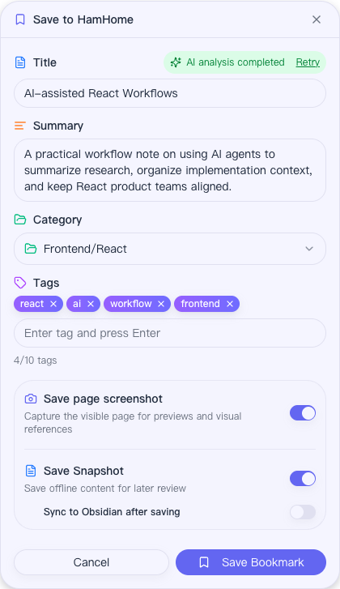 | 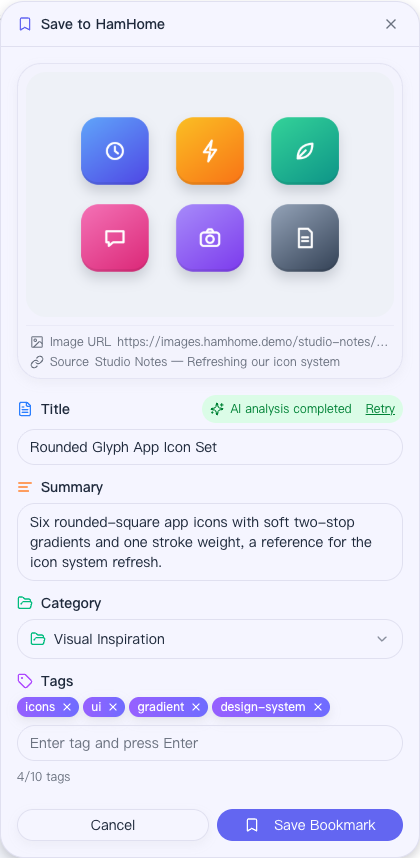 |
| Manage your library | Browse the visual gallery |
| 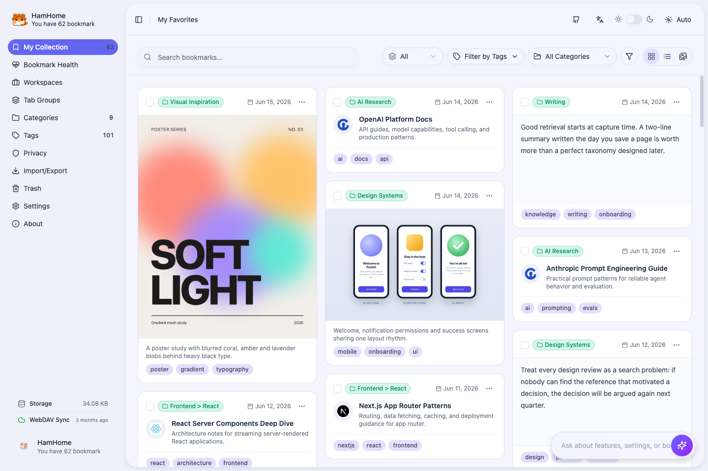 | 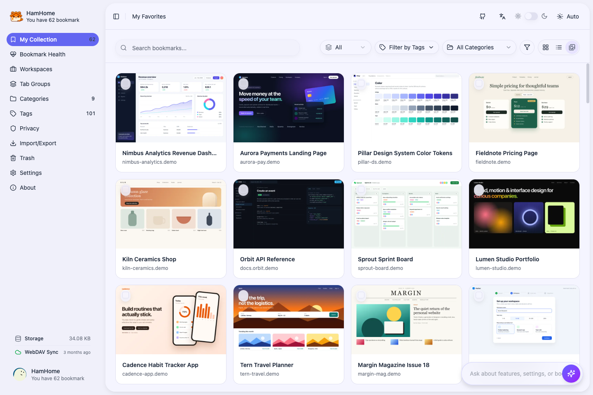 |
| Check bookmark health | Restore from Trash |
| 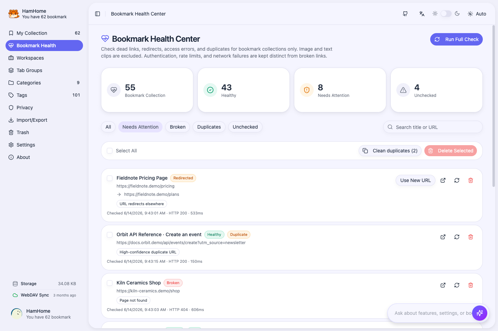 | 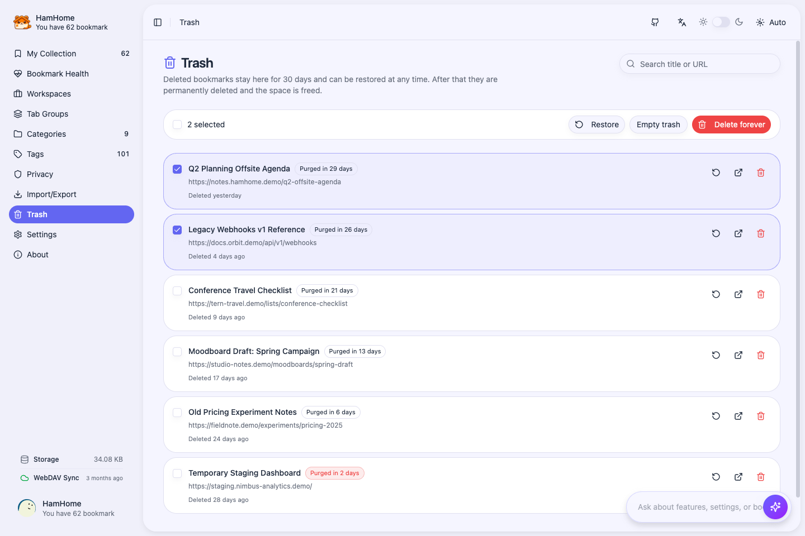 |
| Search with Agent | Restore workspaces |
| 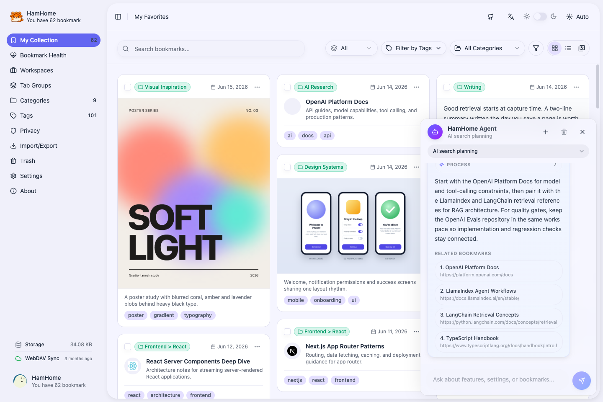 | 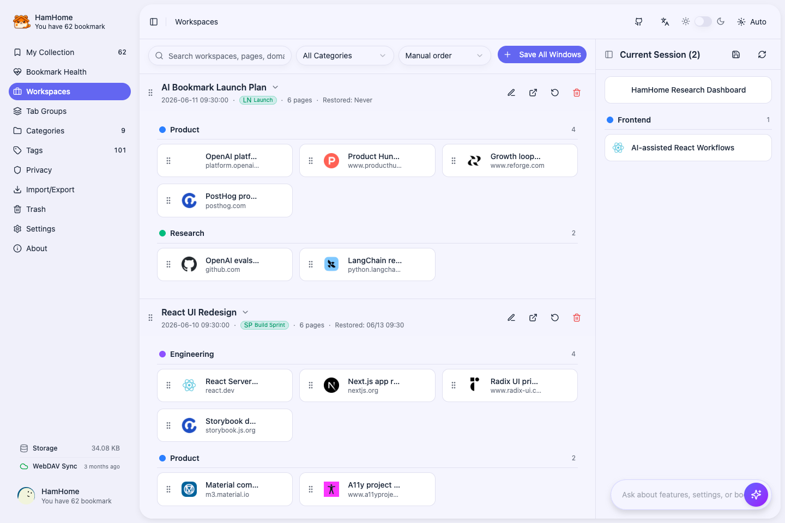 |
| Automate Tab Groups | Import, export, and sync |
| 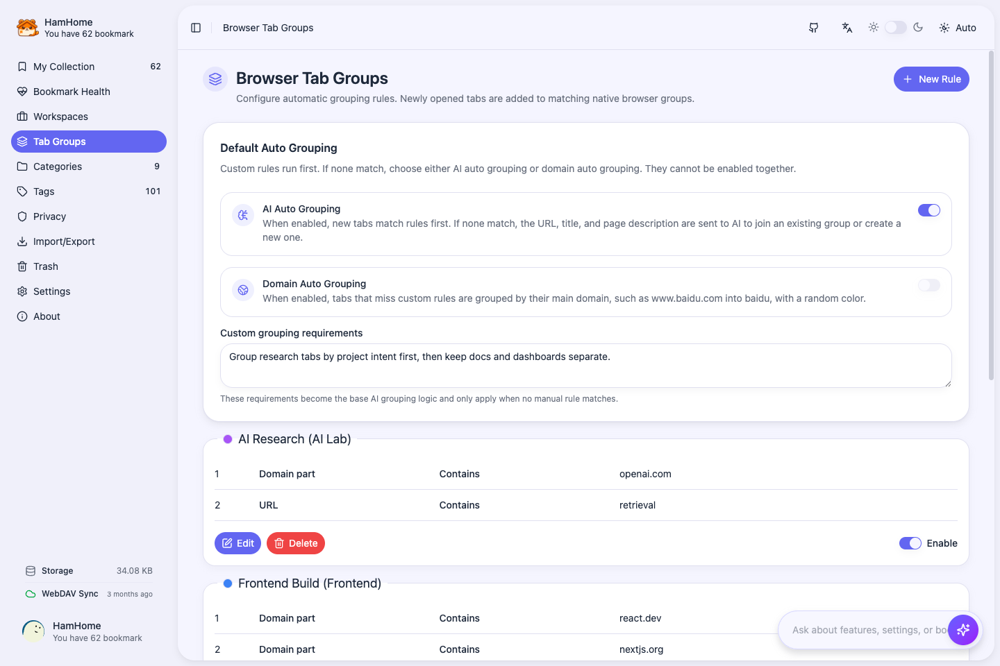 | 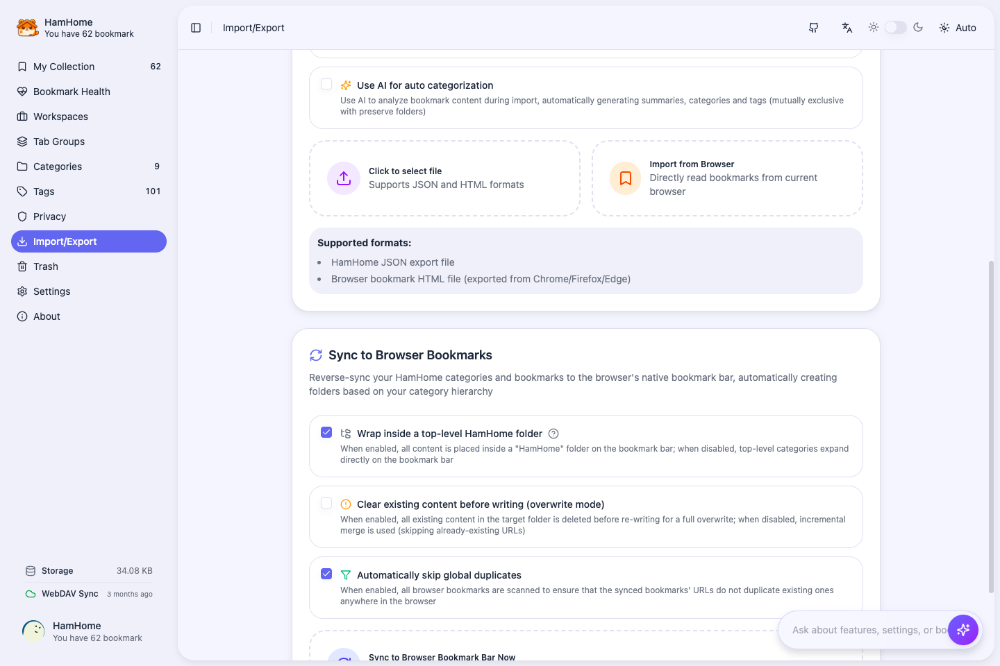 |

## First Setup

1. Install HamHome from the browser store or a GitHub Release package.
2. Open the HamHome app from the context menu item `Open HamHome`, the quick panel behind the extension icon, or the page opened after installation.
3. In `Settings -> General`, choose language, theme, panel side, auto-save snapshot, default page screenshots, private page screenshots, automatic bookmark checks, omnibox search, and browser shortcuts.
4. In `Settings -> AI`, choose a provider, model, API key, Base URL, advanced options, and preset tags, and decide whether image clips may be sent for AI analysis. Click the connection test before relying on AI features.
5. Optional: enable `Embedding` in `Settings -> AI` if you want semantic search. Configure an embedding provider/model, test it, then run an incremental or full vector rebuild.
6. Optional: in `Settings -> Storage`, configure WebDAV if you want multi-device sync.

AI features are optional. You can save, edit, search, import, export, and organize bookmarks manually without configuring an AI provider.

## Main Entry Points

- **Save current page**: use the suggested shortcut `Ctrl+Shift+X` / `Command+Shift+X`, the context menu item `Save current page`, or `Save current page` in the quick panel. The save form opens as an overlay on the page; turn on `Save in Extension Popup` in `Settings -> General` if you prefer the popup.
- **Clip text or an image**: select text and choose `Save selection` from the context menu, or right-click an image and choose `Save image`.
- **Quick panel**: click the extension icon to save the current page, open the in-page bookmark panel, and check recent saves and common settings.
- **Main app**: use the context menu item `Open HamHome`, the quick panel, or open the extension app page.
- **In-page bookmark panel**: move to the configured screen edge and click the trigger, or use `Ctrl+Shift+L` / `Command+Shift+L`.
- **Save current window as workspace**: use the context menu item, the Workspaces page button, or `Ctrl+Shift+Y` / `Command+Shift+Y`.
- **Address bar search**: type `ham`, press Space/Tab, then enter a query. This searches bookmarks and workspaces when omnibox search is enabled.

Browser shortcuts are controlled by the browser. Use `chrome://extensions/shortcuts`, `edge://extensions/shortcuts`, or the Firefox add-ons shortcut settings if you want to change them.

## Save a Bookmark

Start a save on the page you want to capture. The save panel opens right on the page, and HamHome reads the page title, URL, metadata, readable text, and favicon when available. AI analysis runs in the panel without interrupting your browsing.

In the save panel you can:

- Edit title and description.
- Choose a category and add tags.
- Request AI suggestions for summary/category/tags.
- Save or skip a page screenshot of the visible area.
- Save or skip a local snapshot.
- If snapshot saving is enabled, also sync a Markdown-style note to Obsidian.
- Update or delete the bookmark if the current URL is already saved.

Page screenshot behavior:

- Only the visible part of the page is captured, and HamHome's own UI is hidden while capturing.
- Turn on `Save Page Screenshots by Default` in `Settings -> General` to start every save with the screenshot switch on; each save can still opt out.
- Private pages skip screenshots by default. Set `Private Page Screenshots` to `Allow choice` if you want to decide per page.
- Screenshots are stored locally in IndexedDB and are not part of WebDAV sync or JSON backups.

Snapshot and Obsidian behavior:

- HTML/Markdown snapshots are stored locally in IndexedDB.
- Obsidian sync opens an `obsidian://new` URL and writes notes under the `HamHome` folder by default.
- Obsidian sync needs Obsidian installed and the Obsidian URL scheme enabled.
- If the generated note is unchanged, HamHome can skip duplicate Obsidian writes.

## Clip Text and Images

Clips save the part of a page you care about instead of the whole page.

- **Text clips**: select text, right-click, and choose `Save selection`. The clip keeps the exact quote and its source page, and opening it jumps to that passage through a Text Fragment.
- **Image clips**: right-click an image and choose `Save image`. The clip keeps the image URL, source page, size, format, and dominant colors.
- AI suggests tags and a category for clips. With a vision-capable model it also writes a title and summary for images; turn off `AI analysis for image clips` in `Settings -> AI` to keep images away from the provider. Images on private pages are never sent.
- Clips appear in the library as text and image cards. Click a card to see the full quote or image details, and use the content-type filter to show only bookmarks, images, or text.

## Browse and Organize Bookmarks

The bookmark library is the main place for reviewing, filtering, editing, and cleaning up saved items.

Useful workflows:

- Search by title, URL, description, content, category, tag, domain, or time range.
- Filter by content type (bookmarks, images, text), or pick a custom date range from the calendar in the filter menu.
- Switch between masonry cards, a compact list, and the visual gallery.
- Hover a card that has a page screenshot to preview it, or open the screenshot viewer to download or delete it.
- Edit title, URL, description, category, and tags.
- Open, copy, or delete bookmarks. Deleted bookmarks go to Trash first.
- View, download, update, delete, or sync snapshots.
- Save repeated search conditions as custom filters from the filter menu or `Settings -> General`.

The visual gallery shows only bookmarks that have a page screenshot, which makes it a quick way to browse product UIs, landing pages, and other visual references.

Bulk actions are available after selecting bookmarks.

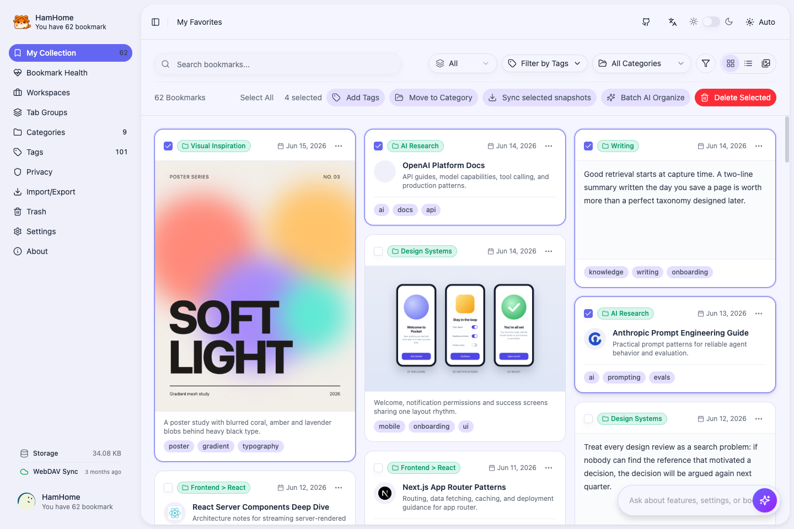

Bulk workflows include:

- Add or remove tags.
- Move selected bookmarks to a category.
- Delete selected bookmarks.
- Re-run AI analysis on selected bookmarks.
- Sync selected snapshots to Obsidian when snapshots are available.

## Bookmark Health Center and Trash

Open `Bookmark Health` to keep a large library tidy. It checks bookmark collections only; image and text clips are excluded.

- Click `Run Full Check` to check every link, or refresh a single row. To check in the background, set `Automatic Bookmark Check` to weekly or monthly in `Settings -> General`.
- Only `404` / `410` responses are marked as broken. Sign-in requirements, rate limits, server errors, network errors, and timeouts get their own status so a temporary failure is never treated as a dead link.
- When a link redirects, `Use New URL` updates the bookmark to the final address.
- Duplicates are found by normalized URL (tracking parameters, fragments, and parameter order are ignored) and are available even before the first check. `Clean duplicates` keeps the earliest bookmark in each group and moves the rest to Trash.
- Filter by all, needs attention, broken, duplicates, or unchecked, and delete selected rows in bulk.

Deleted bookmarks, including those removed from the Health Center, wait in `Trash` for 30 days together with their content, snapshots, screenshots, and clips.

- Restore selected bookmarks, delete them forever, or empty the whole trash.
- Each row shows how many days are left before it is purged.
- After 30 days, or after a permanent delete, HamHome frees the data and keeps only a lightweight tombstone so the deletion also reaches your other devices through WebDAV.

## Categories and Tags

Use `Categories` to build the stable hierarchy of your bookmark library. Categories support hierarchy and icons.

Recommended setup:

- Create a few top-level categories first.
- Add child categories only for areas you use frequently.
- Use preset category templates if you are starting from scratch.
- Use AI-generated categories if you want HamHome to propose a structure from your scenario.

Use `Tags` for cross-cutting topics. The Tags page shows tag usage and a tag cloud, while preset tags in AI settings help keep AI-generated tags consistent.

## Search, Semantic Search, and AI Agent

HamHome supports three search layers:

- **Keyword search**: exact or partial matches against title, URL, description, content, tags, and categories.
- **Semantic search**: natural-language retrieval using embeddings and local vector storage.
- **AI Agent search**: conversational search that can call HamHome search tools, explain results, and show clickable sources.

For semantic search:

1. Open `Settings -> AI`.
2. Enable `Embedding`.
3. Choose provider, API key/Base URL if needed, model, dimensions if supported, and batch size.
4. Test the embedding connection.
5. Run an incremental rebuild for missing vectors or a full rebuild after changing models.

If AI search returns poor results, check vector coverage, confirm that older imported bookmarks have descriptions/content, and try combining natural language with category/tag filters.

## In-page Panel

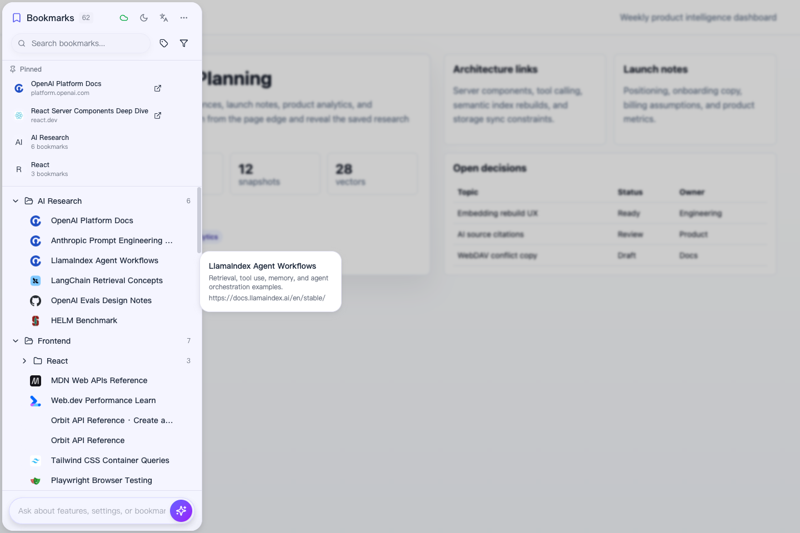

The in-page panel lets you search and open saved bookmarks without leaving the current website.

You can:

- Open it from the edge trigger.
- Toggle it with the browser shortcut.
- Choose left or right position in `Settings -> General`.
- Search bookmarks and open results in a new tab.
- Jump to settings or the main HamHome app from panel actions.

The panel only responds while the page is visible and focused, so it does not keep opening on inactive tabs.

## Workspaces

Workspaces are for temporary or repeatable browsing contexts: research sessions, project tabs, planning flows, or any group of pages you want to restore later.

You can:

- Save the current window as a workspace.
- Include page order, URL, title, domain, favicon, pinned state, and native Tab Group metadata.
- Add a name, description, workspace category, and workspace tags.
- Restore all or selected pages into the current window or a new window.
- Skip duplicate URLs during restore.
- Drag current tabs into a workspace.
- Drag pages between workspaces or between saved Tab Groups.
- Edit page title/URL or save a workspace page as a normal bookmark.

Workspace categories are separate from bookmark categories. Use them for project/session organization, not long-term knowledge taxonomy.

## Tab Group Automation

The `Tab Groups` page manages native browser Tab Group automation.

Manual rules:

- Rule matching supports domain, URL text, title, case-insensitive title, and regex conditions.
- Conditions include contains, equals, starts with, ends with, and regex.
- Each rule has a target group title, color, enabled state, collapsed state, and order.
- You can add multiple matchers to a rule. If any matcher hits, the tab joins the target group.

Fallback automation:

- **AI auto grouping**: when no manual rule matches, HamHome can send URL, title, page metadata, existing group names, and your custom grouping instructions to the configured AI provider.
- **Domain auto grouping**: when no manual rule matches, HamHome can group by the root domain, such as `docs.example.com` -> `example`.
- AI fallback and domain fallback are mutually exclusive.
- Manual rules always run first.

Notes:

- Chromium browsers use `chrome.tabGroups` to apply groups automatically.
- Pinned tabs are skipped.
- Tabs restored from a workspace are suppressed briefly so restore does not immediately re-group them.
- Firefox can store rules, but automatic native Tab Group execution depends on browser API support.

## Import, Export, Browser Bookmarks, and WebDAV

Use `Import / Export` when migrating, backing up, or bridging between HamHome and browser-native bookmarks.

Import options:

- Import a HamHome JSON backup.
- Import a standard browser bookmark HTML file from Chrome, Firefox, or Edge.
- Import directly from the browser bookmarks API.
- Preserve browser folder structure as HamHome categories.
- Or let AI analyze imported bookmarks and generate summaries/categories/tags. This is mutually exclusive with preserving folder structure.
- Optionally fetch page content during import for better AI analysis. This is slower.
- Long HTML import tasks can be cancelled and resumed from stored progress.

Export options:

- JSON export is the full HamHome backup format. It includes bookmarks, clips, categories, workspaces, workspace categories, Tab Group rules, and auto-group settings.
- HTML export generates a readable bookmark page.
- Browser sync writes HamHome bookmarks back to the browser bookmark bar. You can create/use a `HamHome` root folder, clear the target area first, and skip duplicates globally.

WebDAV sync lives in `Settings -> Storage`.

It syncs structured data under `/HamHomeSync`:

- Settings.
- Bookmark metadata and bookmark text content.
- Text and image clips.
- Bookmark categories.
- Workspaces and workspace categories.
- Tab Group rules and auto-group settings.
- Trash state and deletion tombstones, so deletions reach every device.

It does not upload local snapshot files or page screenshots. Download snapshots or use Obsidian sync when you need to move snapshot or note content elsewhere.

WebDAV behavior:

- Bookmarks are matched by URL, so the same page saved on two devices merges into one bookmark instead of duplicating.
- Basic authentication is tried first, with automatic fallback to Digest when the server asks for it. Authentication errors come with an actionable error code.
- Manual sync is available from the Storage tab.
- Background sync runs periodically.
- Local bookmark changes schedule a delayed sync.
- Remote sync uses a lock to reduce multi-device conflicts.
- `Clear Remote Data` deletes the `/HamHomeSync` remote directory. Make sure you have a backup before using it.

## Privacy and Data Boundaries

HamHome is local-first, but some optional features intentionally call external services you configure.

Local by default:

- Bookmarks, clips, categories, settings, workspaces, Tab Group rules, AI cache, vector data, snapshots, and page screenshots are stored in browser storage/IndexedDB.

May leave your browser only when enabled:

- AI analysis may send page URL, title, excerpt/content, category names, and tags to your chosen AI provider. Text clips send the selected text.
- Image clip analysis sends the image to your AI provider while `AI analysis for image clips` is on. Images on private pages are never sent.
- Embedding search sends bookmark/query text to your embedding provider while vectors are built or searched.
- WebDAV sends structured sync data to your WebDAV server.
- Obsidian sync opens an Obsidian URL with generated note content or clipboard handoff.

The Agent will not read or fill API keys, Base URLs, privacy domains, WebDAV credentials, Obsidian-sensitive values, or browser shortcut settings. Configure those manually in settings.

Use privacy domains and automatic privacy detection for sites that should never be analyzed by AI. The same detection keeps page screenshots off private pages by default.

## Troubleshooting

### AI says it is not configured

Open `Settings -> AI`, choose provider/model, fill the API key and Base URL if needed, then run the connection test. Ollama does not require an API key but still needs a reachable local endpoint.

### Semantic search returns few results

Enable Embedding, test the embedding provider, rebuild vectors, and check vector coverage. Imported bookmarks with only title/URL may need page content fetching or AI re-analysis.

### WebDAV sync does nothing

Confirm sync is enabled, URL/username/password are filled, and manual sync is not disabled. Check the displayed sync status and error message in `Settings -> Storage`.

### Storage keeps growing

Snapshots, page screenshots, and vectors are the usual causes. Use `Settings -> Storage` to inspect bookmark, workspace, snapshot, screenshot, and vector data. You can clear snapshots or vectors separately, delete individual screenshots from the screenshot viewer, or export a backup before clearing business data. Items in Trash keep their data until they are restored or purged, so empty the trash to free space right away.

### Tab Groups are not applied

Confirm the browser supports `chrome.tabGroups`, the rule is enabled, the tab is not pinned, and no earlier rule has matched. For AI grouping, verify AI settings and make sure domain auto grouping is not enabled at the same time.

### The Health Center shows sign-in required or rate limited

These statuses mean the site answered but did not let the check through, for example a page behind a login or a site that throttles automated requests. HamHome keeps them separate from broken links on purpose. Open the page to confirm, and delete it only if it is really gone.

### I deleted a bookmark by mistake

Open `Trash` and restore it. Deleted bookmarks stay there for 30 days with their content, snapshots, screenshots, and clips.
