

  

# HamHome 使用文档

本文面向 HamHome 浏览器扩展的日常使用场景。源码构建和开发命令请查看 [README.md](../README.md)。

文中的截图来自扩展截图测试产物，尽量对应当前实际产品界面。

## 功能速览

| 保存当前页面 | 图片剪藏 |
| :--: | :--: |
| 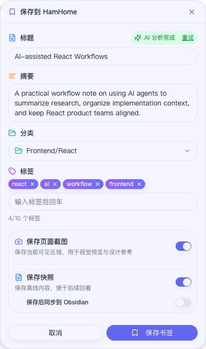 | 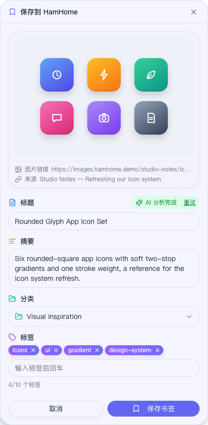 |
| 管理书签库 | 视觉画廊 |
| 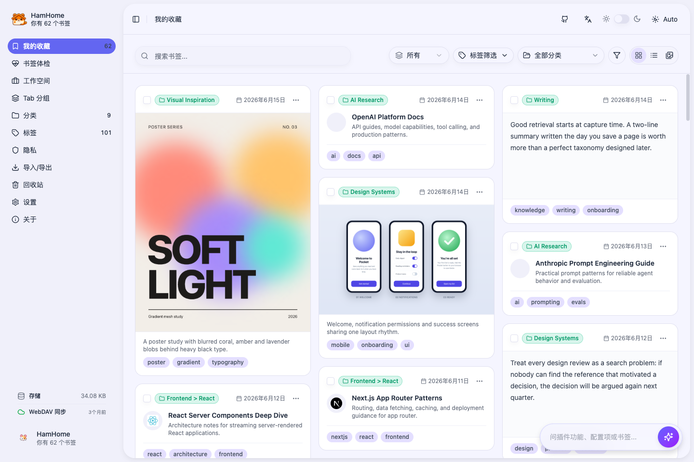 | 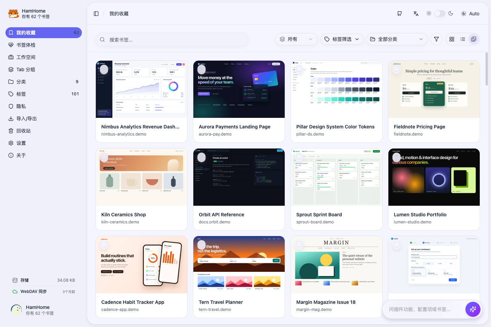 |
| 书签体检 | 回收站恢复 |
| 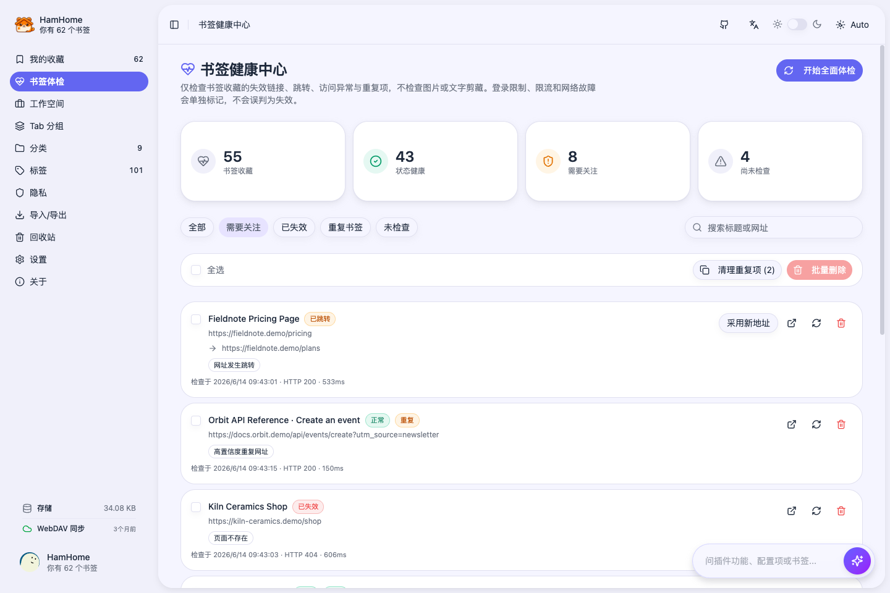 | 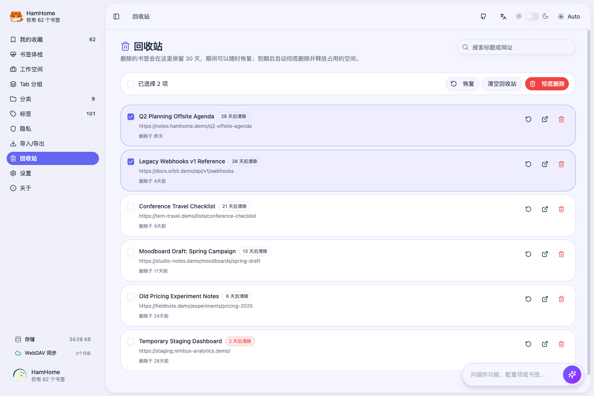 |
| Agent 对话搜索 | 恢复工作空间 |
| 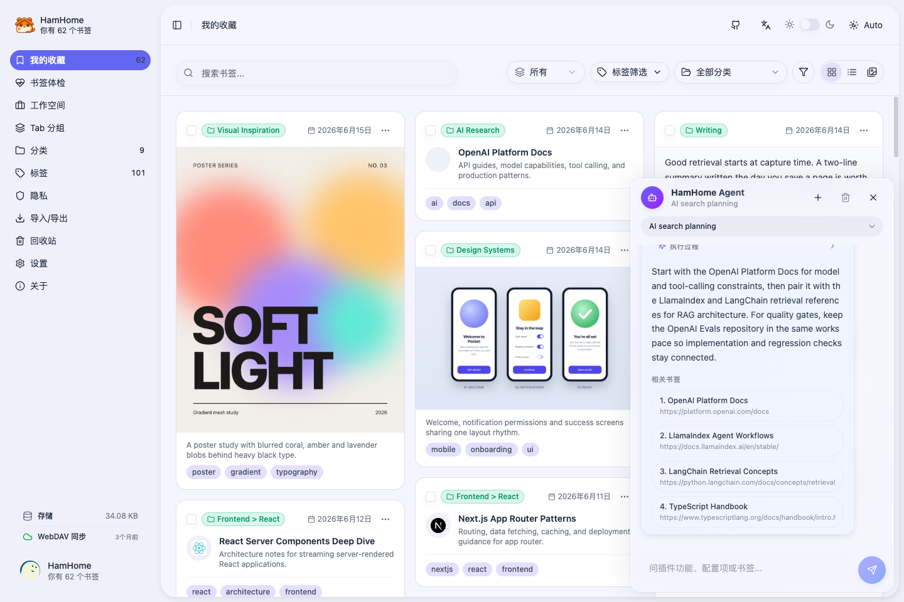 | 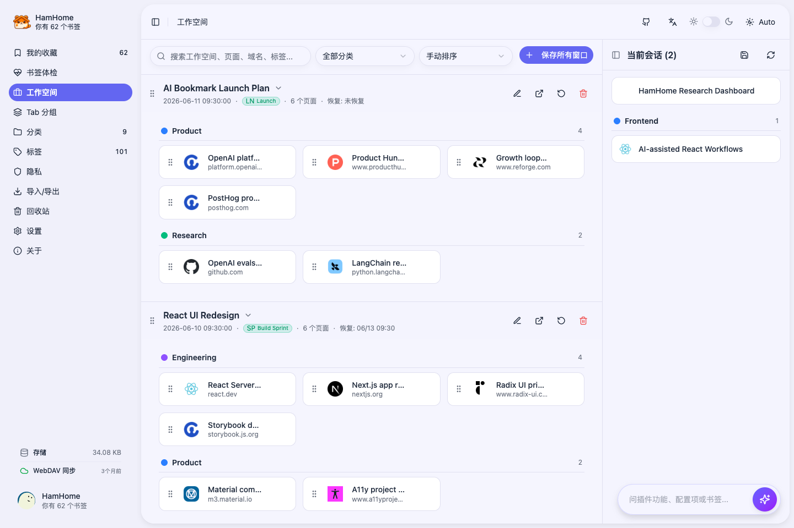 |
| 自动整理 Tab Groups | 导入、导出与同步 |
| 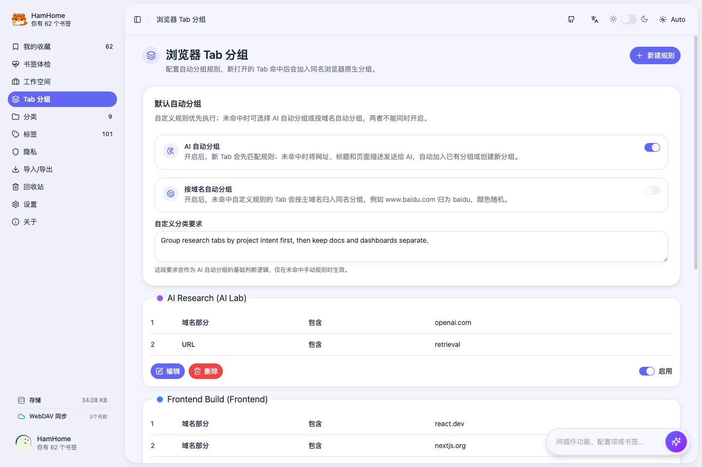 | 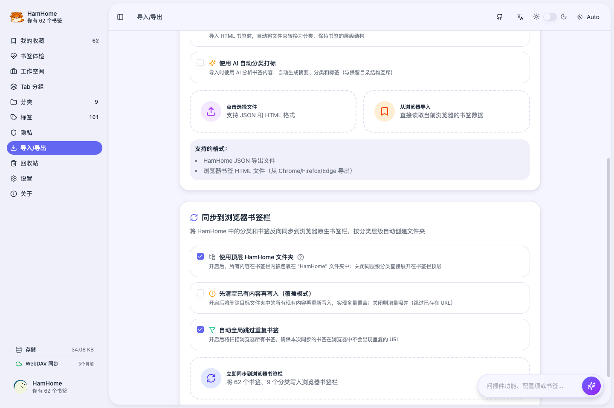 |

## 首次配置

1. 从浏览器扩展商店安装 HamHome，或从 GitHub Release 下载手动安装包。
2. 安装后打开 HamHome 主应用：右键选择 `打开 HamHome`，或从扩展图标的快捷面板、首次安装自动打开的页面进入。
3. 在 `设置 -> 常规` 中确认语言、主题、侧边面板位置、是否自动保存快照、是否默认保存页面截图、隐私页面截图策略、自动书签体检频率、是否启用地址栏搜索和浏览器快捷键。
4. 在 `设置 -> AI` 中选择 Provider、模型、API Key、Base URL、高级选项和预设标签，确认是否允许图片剪藏发送给 AI 分析，并先测试连接。
5. 可选：如果需要语义搜索，在 `设置 -> AI` 中开启 `Embedding`，配置 Embedding Provider/模型，测试连接后执行增量或全量向量重建。
6. 可选：如果需要多设备同步，在 `设置 -> 存储` 中配置 WebDAV。

AI 不是必需项。即使不配置 AI，也可以手动保存、编辑、搜索、导入导出和整理书签。

## 常用入口

- **保存当前页面**：使用建议快捷键 `Ctrl+Shift+X` / `Command+Shift+X`、右键选择 `保存当前页面`，或在快捷面板中点击 `保存当前页面`。保存表单会在当前网页内浮窗打开；如果更习惯在弹窗里填写，可在 `设置 -> 常规` 中开启 `在扩展弹窗中保存`。
- **剪藏文字或图片**：选中文字后右键选择 `保存选中内容`，或在图片上右键选择 `保存图片`。
- **快捷面板**：点击浏览器扩展图标打开，可一键保存当前页、打开网页内书签面板，并查看最近保存与常用设置。
- **主应用**：右键选择 `打开 HamHome`，或通过快捷面板/网页内面板里的入口进入。
- **网页内书签面板**：移动到已配置的屏幕边缘并点击触发条，或使用 `Ctrl+Shift+L` / `Command+Shift+L`。
- **保存当前窗口为工作空间**：右键菜单、工作空间页面按钮，或使用 `Ctrl+Shift+Y` / `Command+Shift+Y`。
- **浏览器地址栏搜索**：在地址栏输入 `ham`，按 Space/Tab 后输入关键词。开启 omnibox 搜索后可搜索书签和工作空间。

浏览器快捷键由浏览器管理。可在 `chrome://extensions/shortcuts`、`edge://extensions/shortcuts` 或 Firefox 扩展快捷键设置中修改。

## 保存书签

在需要收藏的页面触发保存，保存面板会直接在当前网页内打开。HamHome 会尽量读取页面标题、URL、元信息、正文和 favicon，AI 分析期间不会打断浏览。

保存面板中可以：

- 编辑标题和描述。
- 选择分类并添加标签。
- 请求 AI 推荐摘要、分类和标签。
- 选择保存或跳过当前可见区域的页面截图。
- 选择保存或跳过本地快照。
- 如果开启快照保存，也可以把 Markdown 风格笔记同步到 Obsidian。
- 如果当前 URL 已收藏，可以直接更新或删除已有书签。

页面截图行为：

- 只截取网页当前可见区域，截图时会临时隐藏 HamHome 自身界面。
- 在 `设置 -> 常规` 中开启 `默认保存页面截图` 后，每次保存默认勾选截图，仍可单次关闭。
- 隐私页面默认跳过截图；如需逐页决定，可把 `隐私页面截图` 改为 `允许选择`。
- 截图保存在本地 IndexedDB，不进入 WebDAV 同步和 JSON 备份。

快照与 Obsidian 行为：

- HTML/Markdown 快照保存在本地 IndexedDB。
- Obsidian 同步会打开 `obsidian://new` 链接，默认写入 `HamHome` 文件夹。
- Obsidian 同步需要本机安装 Obsidian，并启用 URL Scheme。
- 如果生成的笔记内容未变化，HamHome 可以跳过重复写入。

## 剪藏文字与图片

剪藏只保存页面中你真正关注的部分，而不是整个页面。

- **文字剪藏**：选中文字后右键选择 `保存选中内容`。剪藏会保留原文和来源页，打开时通过 Text Fragment 直接定位到这段文字。
- **图片剪藏**：在图片上右键选择 `保存图片`。剪藏会记录图片地址、来源页、尺寸、格式和主色。
- AI 会为剪藏推荐标签和分类；使用支持图像输入的模型时，还会为图片生成标题和摘要。不希望图片发送给 AI 时，可在 `设置 -> AI` 中关闭 `图片剪藏 AI 分析`；隐私页面上的图片始终不会发送。
- 剪藏会以文字卡片、图片卡片的形式出现在书签库中。点击卡片可查看完整原文或图片信息，也可以用内容类型筛选只看书签、图片或文本。

## 浏览与整理书签

书签库是查看、筛选、编辑和清理收藏的主页面。

常见操作：

- 按标题、URL、描述、正文、分类、标签、域名或时间范围搜索。
- 按内容类型（书签、图片、文本）筛选，或在筛选菜单中用日历选择自定义时间范围。
- 在瀑布流卡片、紧凑列表和视觉画廊三种视图间切换。
- 悬停带截图的卡片即可预览页面截图，也可以打开截图查看器下载或删除截图。
- 编辑标题、URL、描述、分类和标签。
- 打开、复制或删除书签；删除的书签会先进入回收站。
- 查看、下载、更新、删除或同步快照。
- 在筛选菜单或 `设置 -> 常规` 中创建自定义筛选器，保存常用筛选条件。

视觉画廊只展示保存时截取了页面截图的书签，适合快速回顾产品界面、落地页等视觉参考。

选择多个书签后可以进行批量操作。

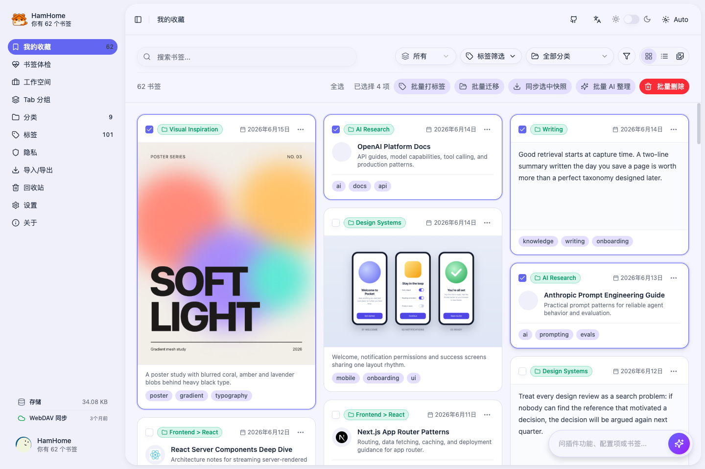

批量操作包括：

- 添加或移除标签。
- 移动到指定分类。
- 删除选中书签。
- 对选中书签重新执行 AI 分析。
- 对有快照的项目批量同步到 Obsidian。

## 书签健康中心与回收站

打开 `书签体检`，可以让大量收藏保持整洁。体检只针对书签收藏，图片与文字剪藏不参与。

- 点击 `开始全面体检` 检查全部链接，也可以单独刷新某一行。如需后台定期检查，在 `设置 -> 常规` 中把 `自动书签体检` 设为每周或每月。
- 只有 `404` / `410` 会被标记为已失效；需要登录、访问受限、服务异常、网络异常和超时都有单独状态，临时故障不会被当成死链。
- 网址发生跳转时，点击 `采用新地址` 即可把书签更新为跳转后的地址。
- 重复书签按规范化网址识别（忽略追踪参数、锚点和参数顺序），未体检也能直接筛出；`清理重复项` 会在每组保留最早收藏的一条，其余移入回收站。
- 支持按全部、需要关注、已失效、重复书签、未检查筛选，并批量删除选中项。

删除的书签（包括在体检中心删除的）会连同正文、快照、截图和剪藏进入 `回收站`，保留 30 天。

- 可以恢复选中书签、彻底删除，或一键清空回收站。
- 每一行都会显示距离自动清除还剩几天。
- 超过 30 天或手动彻底删除后，HamHome 会释放这些数据，只保留一条轻量墓碑，让删除结果通过 WebDAV 同步到其他设备。

## 分类与标签

`分类` 用于建立稳定的书签层级。分类支持父子层级和图标。

推荐做法：

- 先建立少量一级分类。
- 只有高频领域才继续拆二级分类。
- 刚开始使用时可应用预设分类模板。
- 也可以描述使用场景，让 AI 生成一套分类结构后再调整。

`标签` 用于横向主题。标签页会显示标签使用统计和标签云；AI 设置中的预设标签可以让 AI 推荐的标签更稳定。

## 搜索、语义搜索与 AI Agent

HamHome 有三层搜索能力：

- **关键词搜索**：匹配标题、URL、描述、正文、标签和分类。
- **语义搜索**：基于 Embedding 和本地向量数据，用自然语言查找含义相关的书签。
- **AI Agent 搜索**：对话式搜索，可调用 HamHome 搜索工具、解释结果，并展示可点击来源。

开启语义搜索：

1. 打开 `设置 -> AI`。
2. 开启 `Embedding`。
3. 选择 Provider、API Key/Base URL（如需要）、模型、dimensions（如支持）和 batch size。
4. 测试 Embedding 连接。
5. 对缺失向量执行增量重建；更换模型后建议全量重建。

如果 AI 搜索效果一般，先检查向量覆盖率，确认旧导入书签是否有描述/正文，也可以配合分类、标签和时间过滤缩小范围。

## 网页内书签面板

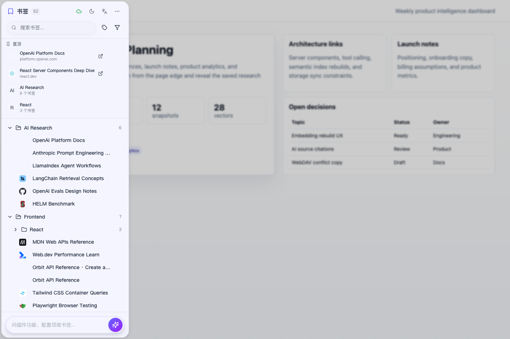

网页内面板可以让你不离开当前网站就搜索并打开收藏。

你可以：

- 通过边缘触发条打开。
- 通过浏览器快捷键切换显示。
- 在 `设置 -> 常规` 中选择左侧或右侧显示。
- 搜索书签并在新标签页打开。
- 从面板快捷入口跳转到设置或 HamHome 主应用。

面板只会在当前页面可见且处于焦点状态时响应，避免在非活跃标签页里误触发。

## 工作空间

工作空间适合保存临时或可重复的浏览上下文，例如调研任务、项目资料、购物比较、旅行规划等。

你可以：

- 将当前窗口保存为工作空间。
- 保存页面顺序、URL、标题、域名、favicon、固定状态和原生 Tab Group 信息。
- 为工作空间设置名称、描述、独立分类和标签。
- 将全部或选中页面恢复到当前窗口或新窗口。
- 恢复时跳过重复 URL。
- 把当前打开的标签拖入某个工作空间。
- 在工作空间之间拖拽页面，或在已保存的 Tab Group 之间调整页面。
- 编辑页面标题/URL，或把工作空间里的某个页面保存为正式书签。

工作空间分类与书签分类是分开的。建议用工作空间分类管理项目/会话，用书签分类管理长期知识库。

## Tab Group 自动化

`Tab 分组` 页面用于管理浏览器原生 Tab Group 自动化。

手动规则：

- 匹配方式支持域名、URL 文本、标题、忽略大小写标题和正则条件。
- 匹配条件支持包含、等于、开头匹配、结尾匹配和正则。
- 每条规则可设置目标分组名称、颜色、启用状态、折叠状态和排序。
- 一条规则可添加多个 matcher；任意一个 matcher 命中后，标签页会进入目标分组。

兜底自动化：

- **AI 自动分组**：当没有手动规则命中时，HamHome 可以把 URL、标题、页面元数据、已有分组名称和你的自定义分组要求发送给已配置的 AI Provider。
- **域名自动分组**：当没有手动规则命中时，按根域名分组，例如 `docs.example.com` -> `example`。
- AI 自动分组和域名自动分组互斥。
- 手动规则始终优先执行。

注意事项：

- Chromium 浏览器通过 `chrome.tabGroups` 自动应用分组。
- 置顶标签页会跳过自动分组。
- 从工作空间恢复的标签页会短暂抑制自动分组，避免恢复后立刻被重新整理。
- Firefox 可以保存规则，但原生自动分组是否执行取决于浏览器 API 支持。

## 导入、导出、浏览器书签与 WebDAV

当你要迁移、备份，或在 HamHome 和浏览器原生书签之间互通时，使用 `导入/导出` 页面。

导入选项：

- 导入 HamHome JSON 备份。
- 导入 Chrome、Firefox、Edge 等浏览器导出的标准书签 HTML 文件。
- 通过浏览器 bookmarks API 直接导入原生书签。
- 将浏览器文件夹结构保留为 HamHome 分类。
- 或让 AI 分析导入的书签并生成摘要、分类、标签。它与保留目录结构互斥。
- 可选获取页面内容以提升 AI 分析准确度，但速度会更慢。
- 较长的 HTML 导入任务支持取消，并可从已保存的进度恢复。

导出选项：

- JSON 导出是完整 HamHome 备份格式，包含书签、剪藏、分类、工作空间、工作空间分类、Tab 分组规则和自动分组设置。
- HTML 导出会生成可浏览的书签页面。
- 浏览器同步会把 HamHome 书签写回浏览器书签栏。可选择创建/使用 `HamHome` 根文件夹、写入前清空目标区域、全局跳过重复 URL。

WebDAV 同步位于 `设置 -> 存储`。

它会在 `/HamHomeSync` 下同步结构化数据：

- 应用设置。
- 书签元数据和书签正文。
- 文字与图片剪藏。
- 书签分类。
- 工作空间和工作空间分类。
- Tab 分组规则和自动分组设置。
- 回收站状态与删除墓碑，让删除结果同步到每台设备。

它不会上传本地快照文件和页面截图。如果需要迁移快照或笔记内容，请手动下载快照，或使用 Obsidian 同步工作流。

WebDAV 行为：

- 书签按网址对齐身份：同一页面在两台设备上分别收藏，同步后会合并为一条，不再重复。
- 认证先尝试 Basic，服务器要求时自动切换为 Digest；认证失败时会给出可操作的错误码。
- 可在存储页手动同步。
- 后台会定期同步。
- 本地书签变化后会延迟触发同步。
- 远端同步使用锁机制，降低多设备冲突概率。
- `清除远端数据` 会删除远端 `/HamHomeSync` 目录。操作前请确认已有备份。

## 隐私与数据边界

HamHome 默认本地优先，但部分可选功能会调用你配置的外部服务。

默认本地保存：

- 书签、剪藏、分类、设置、工作空间、Tab 分组规则、AI 缓存、向量数据、快照和页面截图保存在浏览器存储/IndexedDB 中。

仅在启用对应功能后可能离开浏览器：

- AI 分析可能向你选择的 AI Provider 发送页面 URL、标题、摘要/正文片段、分类名和标签；文字剪藏会发送选中的文字。
- 开启 `图片剪藏 AI 分析` 时，图片剪藏会把图片发送给 AI Provider；隐私页面上的图片始终不会发送。
- Embedding 搜索在构建向量或查询时，会向 Embedding Provider 发送书签/查询文本。
- WebDAV 会把结构化同步数据发送到你配置的 WebDAV 服务。
- Obsidian 同步会打开带笔记内容的 Obsidian URL，或通过剪贴板兜底传递内容。

Agent 不会读取或代填 API Key、Base URL、隐私域名、WebDAV 凭据、Obsidian 敏感信息或浏览器快捷键。这些内容请手动在设置中配置。

对不希望被 AI 分析的网站，请使用隐私域名和自动隐私检测；同一套检测也会让隐私页面默认跳过页面截图。

## 常见问题

### 提示 AI 未配置

打开 `设置 -> AI`，选择 Provider/模型，填写 API Key 和 Base URL（如需要），然后测试连接。Ollama 不需要 API Key，但需要本地端点可访问。

### 语义搜索结果少

开启 Embedding，测试 Embedding Provider，重建向量，并检查向量覆盖率。只有标题/URL 的导入书签通常需要获取页面内容或重新 AI 分析。

### WebDAV 同步没有反应

确认同步已开启，URL/用户名/密码已填写，手动同步按钮没有被禁用。可在 `设置 -> 存储` 查看同步状态和错误信息。

### 存储占用越来越大

常见原因是快照、页面截图和向量数据。可在 `设置 -> 存储` 查看书签、工作空间、快照、截图和向量数据；也可以单独清理快照或向量、在截图查看器中逐张删除截图，或先导出备份再清理业务数据。回收站里的书签在恢复或清除前仍占用空间，清空回收站可以立即释放。

### Tab Groups 没有自动分组

先确认浏览器支持 `chrome.tabGroups`，规则已启用，标签页不是置顶状态，并且没有更靠前的规则已命中。若使用 AI 分组，请检查 AI 设置，并确认没有同时启用域名自动分组。

### 书签体检显示「需要登录」或「访问受限」

这表示站点有响应，但没有让检查请求通过，例如需要登录的页面，或会限制自动请求频率的站点。HamHome 会刻意把这类状态与「已失效」分开。建议先打开页面确认，确实失效再删除。

### 误删了书签

打开 `回收站` 恢复即可。删除的书签会连同正文、快照、截图和剪藏在回收站保留 30 天。
