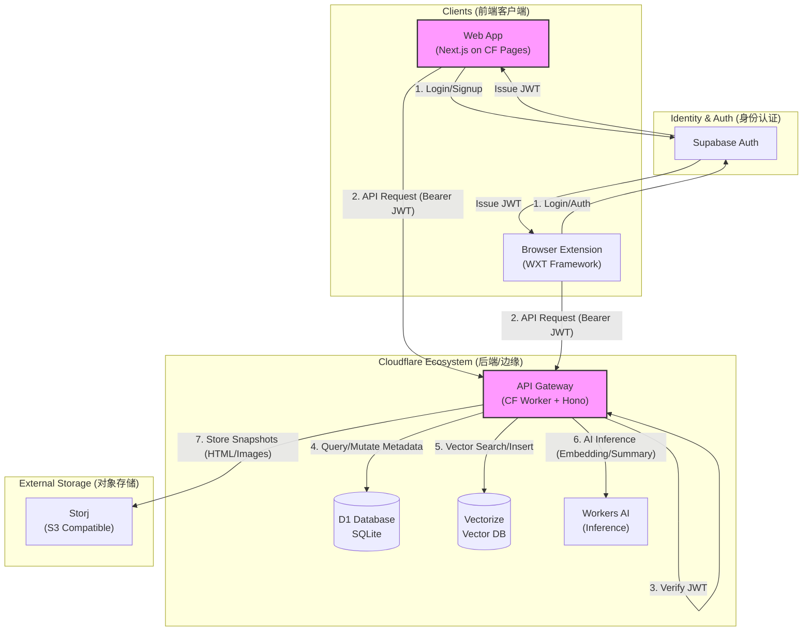

# HamHome 技术方案设计文档 (Cloudflare 原生版)

## 1. 技术选型 (Tech Stack)

### 1.1 前端 (Frontend)
- **Web 客户端**: Next.js (React) - 导出为静态站点 (Static Export) 或通过 `next-on-pages` 部署到 Cloudflare Pages。
- **UI 框架**: Tailwind CSS + Shadcn/UI (Radix UI)。
- **状态管理**: Zustand.
- **数据获取**: TanStack Query.
- **浏览器插件**: WXT (Next-gen Web Extension Framework) - 基于 Vite，开发体验极佳，支持 React/Vue/Svelte，自动处理 Manifest 和构建。
- **HTML 打包**: **SingleFile** (或类似库) - 在客户端将网页 DOM 打包为单文件 HTML。

### 1.2 后端 (Backend - Serverless)
- **运行时**: **Cloudflare Workers** - 极致的冷启动速度，免费额度高。
- **Web 框架**: **Hono** - 适配 Cloudflare Workers，支持 TypeScript。
- **数据库**: **Cloudflare D1** (基于 SQLite 的 Serverless DB)。
- **ORM**: **Drizzle ORM** - 对 D1 支持最好，轻量且类型安全。
- **向量数据库**: **Cloudflare Vectorize** - 原生向量数据库，免费且集成好。
- **对象存储**: **Storj (S3 Compatible)** - 去中心化云存储，S3 兼容，成本极低，用于存储 HTML 快照和图片。

### 1.3 基础设施与服务 (Infra & Services)
- **身份认证**: 使用Supabase Auth实现登录注册认证相关服务。
- **AI LLM**: 
  - **OpenAI / Anthropic** (BYOK 模式)。
  - **Local AI** (Ollama)。
- **公开归档 (可选)**: **Wayback Machine (web.archive.org)** - 用于公开内容的永久备份。

## 2. 系统架构 (System Architecture)

### 2.1 架构概览 (Architecture Overview)

系统采用典型的 **前后端分离 + Serverless** 架构，充分利用 Cloudflare 的边缘计算能力。



### 2.2 核心交互流程

1.  **部署架构**:
    *   **Web App**: 托管于 **Cloudflare Pages** (运行于 Edge Runtime)。
    *   **API**: 托管于 **Cloudflare Workers**。
    *   **Extension**: 打包发布至 Chrome/Edge 商店，本地运行。

2.  **认证流程 (Auth Flow)**:
    *   客户端 (Web/Ext) 直接与 **Supabase** 交互完成登录/注册。
    *   获取 `access_token` (JWT)。
    *   向 API 发起请求时，在 Header 中携带 `Authorization: Bearer <token>`。
    *   Worker Middleware 使用 `SUPABASE_JWT_SECRET` 校验 Token 有效性并解析 User ID。

3.  **数据存储策略**:
    *   **D1**: 存储用户、书签、标签、分类等关系型数据。
    *   **Vectorize**: 存储文本向量 (Embeddings)，用于语义搜索。
    *   **Storj (S3)**: 存储体积较大的网页快照 (HTML) 和截图。

## 3. 数据库设计 (Schema - Drizzle ORM + SQLite)

### 3.1 核心实体设计

```typescript
// schema.ts (Drizzle)
import { sqliteTable, text, integer, index } from "drizzle-orm/sqlite-core";

export const users = sqliteTable("users", {
  id: text("id").primaryKey(), // 使用 nanoid 或 uuid
  email: text("email").notNull().unique(),
  passwordHash: text("password_hash"),
  name: text("name"),
  avatar: text("avatar"),
  createdAt: integer("created_at", { mode: "timestamp" }).defaultNow(),
});

export const bookmarks = sqliteTable("bookmarks", {
  id: text("id").primaryKey(),
  userId: text("user_id").notNull().references(() => users.id, { onDelete: "cascade" }),
  url: text("url").notNull(),
  title: text("title"),
  description: text("description"), // AI 生成的摘要
  content: text("content"), // 提取的正文
  collectionId: text("collection_id").references(() => collections.id),
  
  // 快照相关
  snapshotKey: text("snapshot_key"), // S3 object key (存储私有 HTML 快照)
  waybackUrl: text("wayback_url"), // Wayback Machine 的公开链接 (可选)
  
  isArchived: integer("is_archived", { mode: "boolean" }).default(false),
  isDeleted: integer("is_deleted", { mode: "boolean" }).default(false),
  createdAt: integer("created_at", { mode: "timestamp" }).defaultNow(),
  updatedAt: integer("updated_at", { mode: "timestamp" }).defaultNow(),
}, (table) => ({
  urlIdx: index("url_idx").on(table.url),
  userIdIdx: index("user_id_idx").on(table.userId),
}));

export const collections = sqliteTable("collections", {
  id: text("id").primaryKey(),
  userId: text("user_id").notNull().references(() => users.id, { onDelete: "cascade" }),
  name: text("name").notNull(),
  parentId: text("parent_id").references((): AnySQLiteColumn => collections.id), // 自引用
});

export const tags = sqliteTable("tags", {
  id: text("id").primaryKey(),
  userId: text("user_id").notNull().references(() => users.id, { onDelete: "cascade" }),
  name: text("name").notNull(),
});

export const bookmarksToTags = sqliteTable("bookmarks_to_tags", {
  bookmarkId: text("bookmark_id").notNull().references(() => bookmarks.id, { onDelete: "cascade" }),
  tagId: text("tag_id").notNull().references(() => tags.id, { onDelete: "cascade" }),
}, (t) => ({
  pk: index("pk").on(t.bookmarkId, t.tagId),
}));
```

## 4. 关键流程调整 (Client-First AI Workflow)

### 4.1 智能收藏流程 (同步交互)
1.  **客户端处理**:
    -   **正文提取**: 插件提取正文。
    -   **AI 分析**: 调用 LLM 生成 **标题、摘要、分类、标签**。
    -   **Embeddings**: 生成向量。
    -   **快照打包**: 使用 SingleFile 将当前页面打包为 HTML 字符串。
2.  **用户确认**:
    -   用户预览并修改 AI 结果。
    -   用户勾选是否上传“私有快照” (默认是) 或“公开归档到 Wayback Machine” (默认否)。
3.  **提交保存**:
    -   前端将 Payload (元数据 + 向量 + HTML文件流) 发送给后端 Worker。
4.  **后端存储**:
    -   Worker 接收请求，校验 Auth。
    -   将元数据写入 **D1**。
    -   将向量写入 **Vectorize**。
    -   将 HTML 快照上传至 **Storj** (通过 S3 API)，获取 Key 存入数据库。
    -   (若勾选 Wayback) 触发异步任务调用 Wayback API (或客户端直接调用)。

### 4.2 书签导入流程
1.  前端解析 HTML 书签文件。
2.  **分批处理**:
    -   若用户勾选“AI 处理”，则前端分批次调用 AI 接口生成元数据和向量。
3.  前端将处理好的数据批量提交给后端保存。

### 4.3 全文搜索
-   **混合搜索**:
    -   **语义搜索**: 前端输入查询词 -> 调用 Embedding 接口转向量 -> 调用 Worker 查询 Vectorize -> 返回相似 ID。
    -   **关键词搜索**: 调用 Worker 查询 D1 (SQL LIKE)。
    -   前端或后端合并两者结果并排序。

### 4.4 插件独立鉴权方案 (Standalone Auth)

插件与 Web 端将采用完全独立的会话管理机制，不依赖 Cookie 互通，确保架构解耦且适应性更强。

#### 4.4.1 登录流程
1.  **入口**: 插件 Popup 界面提供“登录”按钮。
2.  **方式**:
    -   **账号/密码登录**: 直接在插件内输入账号密码，调用后端 `/auth/login` 接口获取 JWT。
    -   **第三方登录 (OAuth)**: 点击按钮打开浏览器新标签页进行 OAuth 授权，回调成功后展示 Token (或通过 Deep Link 唤起插件 - *MVP 阶段建议优先使用账号/密码或手动填入 Token* )。
3.  **存储**: 获取到的 JWT Token 存储在 `chrome.storage.local` 中。

#### 4.4.2 请求鉴权
-   插件向 Cloudflare Worker 发起 API 请求时，从 `chrome.storage.local` 读取 Token。
-   在 HTTP Header 中携带：
    ```http
    Authorization: Bearer <JWT_TOKEN>
    ```
-   Worker 验证 Token 有效性；若失效 (401)，插件端提示用户重新登录并清除本地 Token。

#### 4.4.3 登出
-   用户点击“退出登录”，插件清除 `chrome.storage.local` 中的 Token，界面恢复未登录态。

## 5. 成本分析
-   **Workers**: 10万请求/天 (免费)。
-   **D1**: 5GB 存储 (免费)。
-   **Storj**: 25GB 免费存储，50GB 免费带宽。
-   **Vectorize**: 3000万写入/月 (免费)。
-   **Workers AI**: 10000 Neurons/天 (免费)。
-   **Pages**: 免费。
-   **Wayback Machine**: 免费。

## 6. 开发阶段规划

1.  **Setup**: 初始化 Monorepo，包含 `web`, `extension` (WXT), `api` (Worker)。
2.  **Infra**: 配置 D1, Vectorize，以及 Storj S3 Credentials。
3.  **Database**: 定义 Drizzle Schema。
4.  **Auth**: 实现用户认证。
5.  **Extension Core**: 实现插件侧的正文提取、SingleFile 打包和 UI 面板。
6.  **AI Integration**: 实现插件侧调用 AI (CF/OpenAI) 生成元数据。
7.  **Backend CRUD**: 实现接收完整数据并存入 D1/Vectorize/Storj 的接口。
